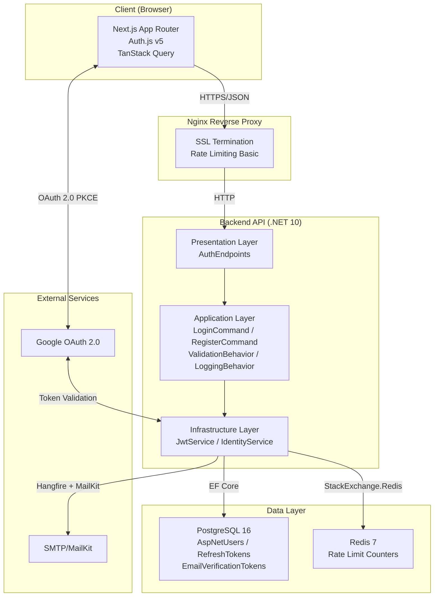

# Phân Tích Module FR-AUTH – Culinary Blog SRS v1.0.0

> **Tài liệu nguồn:** SRS_Culinary_Blog_v1.0.0.pdf (Approved – 04/06/2026)
> **Phạm vi phân tích:** Module Xác thực và Quản lý Người dùng (FR-AUTH)
> **Phân loại kết luận:** `[SRS]` = Từ SRS | `[INFERENCE]` = Suy luận hợp lý | `[PROPOSAL]` = Đề xuất chuyên gia | `[DECISION]` = Quyết định đã chọn
> **Cập nhật:** Thêm phần Quyết định chọn lọc dựa trên team review

---

## 1. FR-AUTH Overview

### Scope `[SRS]`

Module FR-AUTH quản lý **toàn bộ vòng đời xác thực người dùng**: từ đăng ký, đăng nhập đa phương thức, duy trì phiên làm việc với cơ chế token rotation, đến quản lý hồ sơ cá nhân. Backend sử dụng **ASP.NET Core Identity** kết hợp **JWT** và **OAuth 2.0**.

FR-AUTH bao gồm **8 Functional Requirements** (FR-AUTH-001 đến FR-AUTH-008).

> **[DECISION]** FR-AUTH-008: Email Verification được bổ sung theo Decision 5A.

### Actors `[SRS]`

| Actor | Mô tả | Điều kiện | FR-AUTH Functions |
|-------|--------|-----------|-------------------|
| **Guest (Anonymous)** | Người dùng chưa xác thực | Không cần tài khoản | FR-AUTH-001, FR-AUTH-003 (lần đầu) |
| **Author** | Người dùng đã đăng ký, role mặc định | Có tài khoản & JWT hợp lệ | FR-AUTH-002 → FR-AUTH-008 |
| **Admin** | Quản trị viên, quyền cao nhất | Có tài khoản & role Admin | FR-AUTH-002 → FR-AUTH-008 |

### Responsibilities `[SRS]`

1. Đăng ký tài khoản mới (email/password)
2. Đăng nhập email/password (Local Login)
3. Đăng nhập/đăng ký qua Google OAuth 2.0
4. Duy trì phiên làm việc qua JWT Access Token + Refresh Token Rotation
5. Đăng xuất (Revoke Refresh Token)
6. Xem hồ sơ cá nhân
7. Cập nhật hồ sơ cá nhân (bao gồm bio)
8. Xác nhận email

> **[DECISION]** FR-AUTH-007 mở rộng bao gồm bio field (Decision 4A).
> **[DECISION]** FR-AUTH-008 bổ sung cho Email Verification (Decision 5A).

### Dependencies `[SRS]`

| Dependency | Mô tả | Hướng tích hợp |
|------------|--------|-----------------|
| **PostgreSQL 16** | Lưu trữ user data, refresh tokens | Backend → PostgreSQL (EF Core) |
| **ASP.NET Core Identity** | User management, password hashing, role management | In-process |
| **Google OAuth 2.0** | External identity provider | Client ↔ Google ↔ Backend |
| **Hangfire** | Gửi welcome email + verification email bất đồng bộ | Backend (internal) |
| **SMTP/Email Service** | Gửi email chào mừng và xác nhận | Backend → SMTP (MailKit) |
| **Redis** | Rate limiting counters, distributed cache | Backend → Redis |

### Boundary `[SRS]`

FR-AUTH **KHÔNG** bao gồm:

- ~~Quản lý user bởi Admin (CRUD users)~~ → **Out-of-Scope v1.0** `[DECISION 8B]`
- ~~Forgot Password / Reset Password~~ → **Out-of-Scope v1.0** `[DECISION 6C]`
- ~~Change Password~~ → **Out-of-Scope v1.0** `[DECISION 6C]`
- ~~Email Verification~~ → **Đã bổ sung FR-AUTH-008** `[DECISION 5A]`

> **[DECISION 6C]** Các tính năng Password (Forgot/Change) được ghi rõ là Out-of-Scope cho v1.0, có thể phát triển trong v1.1+.
> **[DECISION 8B]** Admin User Management được ghi rõ là Out-of-Scope v1.0, có thể mở rộng trong tương lai.

---

## 2. Functional Decomposition

```
FR-AUTH (Module Xác thực và Quản lý Người dùng)
├── FR-AUTH-001: Đăng ký Tài khoản (User Registration)           [M – Must Have]
├── FR-AUTH-002: Đăng nhập Email/Mật khẩu (Local Login)          [M – Must Have]
├── FR-AUTH-003: Đăng nhập Google OAuth 2.0                      [S – Should Have]
├── FR-AUTH-004: Làm mới Access Token (Token Refresh)            [M – Must Have]
├── FR-AUTH-005: Đăng xuất (Logout / Token Revocation)           [M – Must Have]
├── FR-AUTH-006: Xem Hồ sơ Cá nhân (View Profile)               [S – Should Have]
├── FR-AUTH-007: Cập nhật Hồ sơ Cá nhân (Update Profile)        [S – Should Have]
└── FR-AUTH-008: Xác nhận Email (Email Verification)             [S – Should Have] ⭐ NEW
```

> **[DECISION]** FR-AUTH-008 bổ sung theo Decision 5A.

**Must Have (4):** FR-AUTH-001, FR-AUTH-002, FR-AUTH-004, FR-AUTH-005
**Should Have (4):** FR-AUTH-003, FR-AUTH-006, FR-AUTH-007, FR-AUTH-008

---

## 3. Functional Requirements Analysis

### FR-AUTH-001: Đăng ký Tài khoản (User Registration) `[SRS]`

| Thuộc tính | Chi tiết |
|------------|----------|
| **Function ID** | FR-AUTH-001 |
| **Tên chức năng** | Đăng ký Tài khoản Mới |
| **Mục đích** | Cho phép Guest tạo tài khoản mới, tự động gán role "Author", auto-login sau đăng ký |
| **Actor** | Guest (Anonymous User) |
| **Mức ưu tiên** | M – Must Have |

**Mô tả:** Hệ thống cho phép người dùng chưa có tài khoản tạo một tài khoản mới bằng cách cung cấp thông tin cơ bản. Sau khi đăng ký thành công, người dùng tự động được gán role "Author" và nhận bộ token để truy cập ngay lập tức (auto-login sau đăng ký). Hệ thống kích hoạt job gửi email chào mừng và email xác nhận bất đồng bộ qua Hangfire.

> **[DECISION 3A]** Auto-login sau đăng ký - trả đầy đủ tokens.
> **[DECISION 5A]** Gửi email xác nhận sau khi đăng ký.

**Preconditions:**
1. Người dùng chưa đăng nhập vào hệ thống
2. Endpoint `POST /api/v1/auth/register` đang hoạt động
3. PostgreSQL database đang kết nối thành công

**Trigger:** Guest gửi HTTP POST đến `/api/v1/auth/register`

**Input:**
```json
{
  "displayName": "string",
  "email": "string",
  "userName": "string",
  "password": "string"
}
```

> **[DECISION 1A]** Sử dụng `displayName` thay vì `fullName` để thống nhất với Data Model và API Spec.

**Main Flow:**
1. Client gửi `POST /api/v1/auth/register` với JSON body
2. `RegisterCommand` được tạo và dispatch đến MediatR
3. `ValidationBehavior` chạy `RegisterCommandValidator`:
   - `displayName` không rỗng, 2-100 ký tự
   - `email` đúng format
   - `userName` không chứa ký tự đặc biệt
   - `password` tối thiểu 8 ký tự (1 chữ hoa, 1 chữ số, 1 ký tự đặc biệt)
4. `RegisterCommandHandler` kiểm tra email chưa tồn tại (`UserManager.FindByEmailAsync`)
5. Tạo `ApplicationUser` mới qua factory method `ApplicationUser.Create(displayName, email, userName)`
6. `UserManager.CreateAsync(user, password)` – Identity hash password với PBKDF2
7. `UserManager.AddToRoleAsync(user, "Author")` – gán role mặc định
8. `JwtService.GenerateAccessToken()` – tạo JWT access token (HS256, 15 phút)
9. `JwtService.GenerateRefreshToken()` – tạo refresh token (512-bit, 7 ngày)
10. Lưu RefreshToken vào bảng `refresh_tokens`
11. `BackgroundJob.Enqueue<WelcomeEmailJob>()` – đẩy job gửi email chào mừng
12. `BackgroundJob.Enqueue<SendVerificationEmailJob>()` – đẩy job gửi email xác nhận `[DECISION 5A]`
13. Trả về HTTP 201 Created với `AuthResponseDto`

> **[DECISION 5A]** Bổ sung bước 12: Gửi email xác nhận sau đăng ký.

**Alternative Flow:**
- **A1 – Email đã tồn tại:** Bước 4 → `ConflictException` → HTTP 409 Conflict (RFC 7807)
- **A2 – Password không đủ mạnh:** Bước 3/6 → `ValidationException` → HTTP 422 Unprocessable Entity
- **A3 – Dữ liệu đầu vào không hợp lệ:** Bước 3 → FluentValidation fail → HTTP 422 (RFC 7807 ValidationProblemDetails)
- **A4 – Database không kết nối:** EF Core `DbUpdateException` → HTTP 500 Internal Server Error

**Exception Flow:**
- Database connection failure → GlobalExceptionMiddleware log lỗi, trả 500, không expose stack trace

**Postconditions:**
1. Tài khoản mới được tạo trong database
2. Role "Author" được gán
3. Refresh token được persist trong DB
4. Email chào mừng được đẩy vào Hangfire queue
5. Email xác nhận được đẩy vào Hangfire queue `[DECISION 5A]`
6. Client nhận được access token + refresh token `[DECISION 3A]`

**Output:**
```json
{
  "accessToken": "string (JWT)",
  "refreshToken": "string",
  "expiresAt": "datetime",
  "user": {
    "id": "guid",
    "displayName": "string",
    "email": "string",
    "userName": "string",
    "avatarUrl": "string|null",
    "roles": ["Author"]
  }
}
```

> **[DECISION 1A]** Response sử dụng `displayName`.
> **[DECISION 3A]** Response bao gồm đầy đủ tokens để auto-login.

**Business Rules:**
- BR-AUTH-001: Email phải unique trong hệ thống `[SRS]`
- BR-AUTH-002: Password phải ≥ 8 ký tự, 1 chữ hoa, 1 chữ số, 1 ký tự đặc biệt `[SRS]`
- BR-AUTH-003: Mọi tài khoản mới được gán role "Author" mặc định `[SRS]`
- BR-AUTH-004: Auto-login sau đăng ký (trả token ngay) `[SRS]`
- BR-AUTH-005: Welcome email được gửi bất đồng bộ qua Hangfire `[SRS]`
- **BR-AUTH-026**: Verification email được gửi bất đồng bộ qua Hangfire `[DECISION 5A]`

**Dependencies:**
- FR-JOB-001 (Welcome Email Job)
- FR-AUTH-008 (Verification Email Job) `[DECISION 5A]`
- ASP.NET Core Identity
- PostgreSQL

**HTTP Endpoint:** `POST /api/v1/auth/register`
**HTTP Status Codes:** 201 Created | 409 Conflict | 422 Unprocessable Entity | 500 Internal Server Error

---

### FR-AUTH-002: Đăng nhập Email/Mật khẩu (Local Login) `[SRS]`

| Thuộc tính | Chi tiết |
|------------|----------|
| **Function ID** | FR-AUTH-002 |
| **Tên chức năng** | Đăng nhập bằng Email và Mật khẩu |
| **Mục đích** | Cho phép user đã có tài khoản đăng nhập bằng email/password, nhận cặp token mới |
| **Actor** | Author / Admin |
| **Mức ưu tiên** | M – Must Have |

**Mô tả:** Mỗi lần đăng nhập thành công tạo ra một cặp access token mới (JWT, 15 phút) và refresh token mới (7 ngày). Cơ chế Token Rotation: refresh token cũ KHÔNG bị xóa ngay mà được đánh dấu đã sử dụng (để phát hiện token reuse attack).

**Preconditions:**
1. Người dùng đã có tài khoản hợp lệ trong hệ thống
2. Tài khoản chưa bị khóa (LockoutEnabled = false hoặc chưa đến lockout deadline)

**Trigger:** Client gửi `POST /api/v1/auth/login`

**Input:**
```json
{
  "email": "string",
  "password": "string"
}
```

**Main Flow:**
1. Client gửi `POST /api/v1/auth/login`
2. `LoginCommand` dispatch qua MediatR
3. `ValidationBehavior` kiểm tra email format và password không rỗng
4. `LoginCommandHandler` tìm user: `UserManager.FindByEmailAsync(email)`
5. Xác minh mật khẩu: `UserManager.CheckPasswordAsync(user, password)` – so sánh PBKDF2 hash
6. Kiểm tra tài khoản không bị lockout: `UserManager.IsLockedOutAsync(user)`
7. Tạo access token mới: `JwtService.GenerateAccessToken(user, roles)`
8. Tạo refresh token mới: `JwtService.GenerateRefreshToken(userId)`
9. Lưu refresh token mới vào database
10. Ghi nhận đăng nhập thành công: `UserManager.ResetAccessFailedCountAsync(user)`
11. Trả về HTTP 200 OK với `AuthResponseDto`

**Alternative Flow:**
- **A1 – Tài khoản không tồn tại hoặc mật khẩu sai:** HTTP 401 Unauthorized với message generic "Email hoặc mật khẩu không đúng" (tránh User Enumeration Attack)
- **A2 – Tài khoản bị lockout:** HTTP 423 Locked với thông báo thời gian unlock còn lại
- **A3 – Vượt quá 5 lần thử sai:** AccessFailedCount tăng → tài khoản bị lockout 15 phút (LockoutOptions)

**Postconditions:**
- Access token + refresh token mới được tạo và trả về
- Refresh token được lưu vào database
- AccessFailedCount reset về 0

**Output:** `AuthResponseDto` (giống FR-AUTH-001)

**Business Rules:**
- BR-AUTH-006: Không tiết lộ tài khoản có tồn tại hay không khi login fail (chống User Enumeration) `[SRS]`
- BR-AUTH-007: Lockout sau 5 lần thử sai, thời gian lockout 15 phút `[SRS]`
- BR-AUTH-008: Token Rotation – refresh token cũ được đánh dấu đã sử dụng `[SRS]`

**HTTP Endpoint:** `POST /api/v1/auth/login`
**HTTP Status Codes:** 200 OK | 401 Unauthorized | 422 Unprocessable Entity | 423 Locked

---

### FR-AUTH-003: Đăng nhập Google OAuth 2.0 `[SRS]`

| Thuộc tính | Chi tiết |
|------------|----------|
| **Function ID** | FR-AUTH-003 |
| **Tên chức năng** | Đăng nhập / Đăng ký bằng Google OAuth 2.0 |
| **Mục đích** | Hỗ trợ đăng nhập xã hội qua Google, tự động tạo tài khoản nếu chưa có |
| **Actor** | Guest (lần đầu) / Người dùng đã đăng ký qua Google |
| **Mức ưu tiên** | S – Should Have |

> **[DECISION 2B]** Sử dụng luồng Auth.js v5 (client-side) với idToken thay vì ExternalLoginInfo (server-side).

**Mô tả:** Sử dụng OAuth 2.0 Authorization Code Flow với PKCE. Frontend (Next.js + Auth.js v5) xử lý OAuth flow và gửi verified idToken lên backend. Nếu lần đầu → tự động tạo tài khoản từ Google profile (email, display name, avatar URL) và gán role "Author". Nếu email đã tồn tại từ đăng ký thủ công → liên kết Google login với tài khoản hiện có.

**Luồng OAuth đã chốt `[DECISION 2B]`:**
```
1. User click "Login with Google" trên Next.js
2. Auth.js v5 redirect → Google Authorization Endpoint (scopes: openid, email, profile)
3. User consent trên Google Consent Screen
4. Google redirect về callback URL với Authorization Code
5. Auth.js v5 xử lý callback:
   - Lấy access token từ Google
   - Verify token
   - Extract profile (email, name, avatar)
6. Frontend gửi POST /api/v1/auth/google với idToken đã verify
7. Backend verify idToken với Google APIs
8. Tạo/link user account → Trả AuthResponseDto
```

**Preconditions:**
1. Google OAuth 2.0 Credentials (ClientId, ClientSecret) đã cấu hình trong appsettings
2. Redirect URI đã đăng ký trong Google Cloud Console
3. Người dùng có tài khoản Google hợp lệ

**Input `[DECISION 2B]`:**
```json
{
  "idToken": "string (Google ID Token đã verify bởi Auth.js)",
  "email": "string (optional - trích xuất từ token)",
  "name": "string (optional - display name từ Google)",
  "avatarUrl": "string (optional)"
}
```

**Main Flow:**
1. Frontend (Next.js) redirect người dùng đến Google Authorization Endpoint (scopes: openid, email, profile) `[DECISION 2B]`
2. Người dùng xác nhận cấp quyền trên Google Consent Screen
3. Google redirect về callback URL (Next.js) với Authorization Code
4. Auth.js v5 xử lý callback, verify token, lấy profile `[DECISION 2B]`
5. Frontend gửi `POST /api/v1/auth/google` với idToken đã verify `[DECISION 2B]`
6. `GoogleLoginCommandHandler` verify idToken với Google APIs `[DECISION 2B]`
7. Tìm user bằng `UserManager.FindByLoginAsync("Google", providerKey)`
8. **Nếu chưa có tài khoản:** kiểm tra email → email chưa tồn tại → tạo `ApplicationUser` mới từ Google profile, gán role "Author" → `AddLoginAsync`
9. **Nếu email đã tồn tại (đăng ký thủ công trước):** liên kết Google login → `AddLoginAsync` với tài khoản hiện có
10. Tạo access token và refresh token, lưu vào database
11. Trả về HTTP 200 OK với `AuthResponseDto`

**Alternative Flow:**
- **A1 – Google token không hợp lệ:** HTTP 401 Unauthorized
- **A2 – Email Google bị revoke quyền:** HTTP 400 Bad Request
- **A3 – Google API không khả dụng:** HTTP 502 Bad Gateway

**Business Rules:**
- BR-AUTH-009: Tự động tạo tài khoản nếu lần đầu đăng nhập qua Google `[SRS]`
- BR-AUTH-010: Liên kết Google login với tài khoản email đã tồn tại `[SRS]`
- BR-AUTH-011: Role "Author" được gán mặc định cho tài khoản tạo qua Google `[SRS]`
- BR-AUTH-027: idToken phải được verify phía backend trước khi tạo/link account `[DECISION 2B]`

**HTTP Endpoint:** `POST /api/v1/auth/google`
**HTTP Status Codes:** 200 OK | 400 Bad Request | 401 Unauthorized

---

### FR-AUTH-004: Làm mới Access Token (Token Refresh) `[SRS]`

| Thuộc tính | Chi tiết |
|------------|----------|
| **Function ID** | FR-AUTH-004 |
| **Tên chức năng** | Làm mới Access Token bằng Refresh Token |
| **Mục đích** | Cho phép client lấy cặp token mới mà không cần đăng nhập lại |
| **Actor** | Author / Admin (có refresh token hợp lệ) |
| **Mức ưu tiên** | M – Must Have |

**Mô tả:** Khi access token hết hạn (15 phút), client sử dụng refresh token còn hiệu lực để lấy cặp token mới. **Token Rotation bắt buộc:** mỗi lần refresh, refresh token cũ bị vô hiệu hóa (IsRevoked = true, RevokedAt = DateTime.UtcNow) và refresh token MỚI được tạo ra. Đây là biện pháp chống Refresh Token Reuse Attack.

> **[DECISION 7A]** Giữ nguyên stateless JWT. Refresh token có thể revoke được lưu trong DB.

**Preconditions:**
1. Client có refresh token hợp lệ (chưa hết hạn, chưa bị revoke, chưa bị thay thế)
2. User tương ứng vẫn tồn tại và chưa bị khóa

**Main Flow:**
1. Client gửi `POST /api/v1/auth/refresh` với body: `{ "refreshToken": "..." }`
2. `RefreshTokenCommand` dispatch qua MediatR
3. Handler tìm refresh token trong database (bao gồm User navigation property)
4. Kiểm tra: token tồn tại, IsRevoked == false, ExpiresAt > DateTime.UtcNow, user vẫn active
5. Đánh dấu token cũ: IsRevoked = true, ReplacedByToken = newToken, RevokedAt = DateTime.UtcNow
6. Tạo access token mới cho user
7. Tạo refresh token mới, lưu vào database
8. Trả về HTTP 200 OK với `AuthResponseDto` chứa cặp token mới

**Alternative Flow:**
- **A1 – Refresh token không tìm thấy:** HTTP 401 Unauthorized
- **A2 – Refresh token đã hết hạn:** HTTP 401, client phải đăng nhập lại
- **A3 – Refresh token đã bị revoke (Reuse Attack detected):** HTTP 401 + LOG SECURITY ALERT (WARNING). Có thể revoke toàn bộ refresh tokens của user (paranoid mode)
- **A4 – User bị xóa hoặc bị khóa sau khi token được cấp:** HTTP 401

**Business Rules:**
- BR-AUTH-012: Refresh Token Rotation bắt buộc – mỗi lần refresh, token cũ bị vô hiệu hóa `[SRS]`
- BR-AUTH-013: Reuse Detection – nếu token đã revoke bị dùng lại → security alert `[SRS]`
- BR-AUTH-014: Paranoid mode – có thể revoke toàn bộ token family khi phát hiện reuse `[SRS]`
- **BR-AUTH-028**: JWT access token là stateless, không thể revoke trước khi hết hạn `[DECISION 7A]`

**HTTP Endpoint:** `POST /api/v1/auth/refresh`
**HTTP Status Codes:** 200 OK | 401 Unauthorized

---

### FR-AUTH-005: Đăng xuất (Logout / Token Revocation) `[SRS]`

| Thuộc tính | Chi tiết |
|------------|----------|
| **Function ID** | FR-AUTH-005 |
| **Tên chức năng** | Đăng xuất và Thu hồi Refresh Token |
| **Mục đích** | Revoke refresh token, vô hiệu hóa khả năng refresh |
| **Actor** | Author / Admin đang đăng nhập |
| **Mức ưu tiên** | M – Must Have |

**Mô tả:** Vì JWT access token là stateless (không thể revoke trực tiếp trước khi hết hạn), hành động logout chủ yếu là revoke refresh token tương ứng. Client có trách nhiệm xóa access token khỏi bộ nhớ (localStorage/cookie).

> **[DECISION 7A]** JWT access token không thể revoke, client tự xóa token phía mình.

**Preconditions:**
1. Người dùng đang đăng nhập với access token hợp lệ trong Authorization header
2. Client gửi refresh token muốn revoke

**Main Flow:**
1. Client gửi `POST /api/v1/auth/logout` với `Authorization: Bearer {accessToken}` và body: `{ "refreshToken": "..." }`
2. Middleware xác thực JWT (UseAuthentication) xác minh access token
3. `LogoutCommandHandler` tìm refresh token trong database
4. Nếu tìm thấy và thuộc về user hiện tại: đánh dấu IsRevoked = true, RevokedAt = DateTime.UtcNow
5. Lưu thay đổi vào database
6. Trả về HTTP 204 No Content

**Alternative Flow:**
- **A1 – Refresh token không tìm thấy:** Vẫn trả về HTTP 204 (idempotent – không tiết lộ trạng thái)
- **A2 – Access token đã hết hạn:** Vẫn cho phép logout nếu refresh token hợp lệ; hoặc HTTP 401 nếu không cung cấp refresh token

**Business Rules:**
- BR-AUTH-015: Logout là idempotent – không tiết lộ trạng thái token `[SRS]`
- BR-AUTH-016: JWT access token không thể revoke phía server (stateless) – client tự xóa `[SRS]`
- BR-AUTH-017: Chỉ revoke refresh token thuộc về user hiện tại `[SRS]`

**HTTP Endpoint:** `POST /api/v1/auth/logout`
**HTTP Status Codes:** 204 No Content | 401 Unauthorized

---

### FR-AUTH-006: Xem Hồ sơ Cá nhân (View Profile) `[SRS]`

| Thuộc tính | Chi tiết |
|------------|----------|
| **Function ID** | FR-AUTH-006 |
| **Tên chức năng** | Xem Hồ sơ Cá nhân |
| **Mục đích** | Trả về thông tin hồ sơ của người dùng hiện đang đăng nhập |
| **Actor** | Author / Admin đang đăng nhập |
| **Mức ưu tiên** | S – Should Have |

**Mô tả:** Trả về thông tin hồ sơ dựa trên UserId trích xuất từ JWT claims. **Không bao giờ trả về PasswordHash hoặc SecurityStamp.**

**Main Flow:**
1. Client gửi `GET /api/v1/auth/me` với `Authorization: Bearer {accessToken}`
2. Middleware xác thực JWT, trích xuất UserId từ claim NameIdentifier
3. `GetCurrentUserQuery` dispatch qua MediatR
4. Handler tìm user: `UserManager.FindByIdAsync(userId)`
5. Map sang `UserProfileDto`
6. Trả về HTTP 200 OK

**Output:**
```json
{
  "id": "guid",
  "displayName": "string",
  "email": "string",
  "userName": "string",
  "avatarUrl": "string|null",
  "bio": "string|null",
  "roles": ["Author"],
  "emailConfirmed": "boolean",
  "createdAt": "datetime"
}
```

> **[DECISION 1A]** Sử dụng `displayName`. Thêm `bio` field `[DECISION 4A]`.

**Alternative Flow:**
- **A1 – User đã bị xóa sau khi token được cấp:** HTTP 404 Not Found

**Business Rules:**
- BR-AUTH-018: Không trả về thông tin nhạy cảm (password hash, security stamp) `[SRS]`

**HTTP Endpoint:** `GET /api/v1/auth/me`
**HTTP Status Codes:** 200 OK | 401 Unauthorized | 404 Not Found

---

### FR-AUTH-007: Cập nhật Hồ sơ Cá nhân (Update Profile) `[SRS]`

| Thuộc tính | Chi tiết |
|------------|----------|
| **Function ID** | FR-AUTH-007 |
| **Tên chức năng** | Cập nhật Hồ sơ Cá nhân |
| **Mục đích** | Cho phép người dùng cập nhật displayName, avatarUrl, bio |
| **Actor** | Author / Admin đang đăng nhập |
| **Mức ưu tiên** | S – Should Have |

> **[DECISION 4A]** Mở rộng FR-AUTH-007 để bao gồm `bio` field.

**Mô tả:** Sử dụng PATCH (partial update). Email và UserName KHÔNG thể thay đổi qua endpoint này (đây là quy trình riêng có xác nhận OTP).

**Input:**
```json
{
  "displayName": "string (2–100 ký tự, optional)",
  "avatarUrl": "string (URL hợp lệ, optional)",
  "bio": "string (max 500 ký tự, optional)"
}
```

> **[DECISION 1A]** Sử dụng `displayName` thay vì `fullName`.
> **[DECISION 4A]** Thêm `bio` field vào request.

**Main Flow:**
1. Client gửi `PATCH /api/v1/auth/me` với body
2. `UpdateProfileCommand` dispatch, UserId lấy từ JWT claims
3. `ValidationBehavior`: displayName 2–100 ký tự, avatarUrl là URL hợp lệ (nếu cung cấp), bio max 500 ký tự (nếu cung cấp) `[DECISION 4A]`
4. Handler tìm user, cập nhật displayName, avatarUrl, bio `[DECISION 4A]`
5. `UserManager.UpdateAsync(user)`
6. Trả về HTTP 200 OK với `UserProfileDto` đã cập nhật

**Alternative Flow:**
- **A1 – Dữ liệu không hợp lệ:** HTTP 422 Unprocessable Entity

**Business Rules:**
- BR-AUTH-019: Email và UserName không thể thay đổi qua endpoint này `[SRS]`
- BR-AUTH-020: DisplayName phải 2–100 ký tự `[DECISION 1A]`
- **BR-AUTH-029**: Bio tối đa 500 ký tự `[DECISION 4A]`

**HTTP Endpoint:** `PATCH /api/v1/auth/me`
**HTTP Status Codes:** 200 OK | 401 Unauthorized | 422 Unprocessable Entity

---

### FR-AUTH-008: Xác nhận Email (Email Verification) `[DECISION 5A]` ⭐ NEW

| Thuộc tính | Chi tiết |
|------------|----------|
| **Function ID** | FR-AUTH-008 |
| **Tên chức năng** | Xác nhận Email |
| **Mục đích** | User verify email qua link trong email |
| **Actor** | Author / Admin mới đăng ký |
| **Mức ưu tiên** | S – Should Have |

> **[DECISION 5A]** Bổ sung FR-AUTH-008 để xác nhận email sau đăng ký.

**Mô tả:** Sau khi đăng ký, hệ thống gửi email xác nhận với link. User click link để xác nhận email. Khi email được xác nhận, user có thể sử dụng các tính năng yêu cầu "VerifiedAuthor" policy.

**Luồng Email Verification:**
```
1. User đăng ký thành công (FR-AUTH-001)
2. Backend tạo EmailVerificationToken (GUID, expires 24h)
3. Backend gửi email với link:
   https://culinaryblog.com/auth/verify-email?token={token}
4. User click link
5. Frontend gửi GET /api/v1/auth/verify-email?token={token}
6. Backend verify token:
   - Token tồn tại?
   - Chưa hết hạn?
   - Đúng user?
7. Backend update: EmailConfirmed = true
8. Trả về success → User có thể dùng VerifiedAuthor features
```

**Preconditions:**
1. User đã đăng ký thành công
2. Email chưa được xác nhận

**Endpoint:**

| Method | Endpoint | Mô tả |
|--------|----------|--------|
| GET | `/api/v1/auth/verify-email?token={token}` | Xác nhận email qua token |

**Request:**
- GET `/api/v1/auth/verify-email?token=abc123...`

**Response (200 OK):**
```json
{
  "message": "Email đã được xác nhận thành công",
  "emailConfirmed": true
}
```

**Error Responses:**
- HTTP 400: Token không hợp lệ
- HTTP 400: Token đã hết hạn
- HTTP 404: Token không tồn tại

**Business Rules:**
- BR-AUTH-030: Verification token có hiệu lực 24 giờ `[DECISION 5A]`
- BR-AUTH-031: Token chỉ sử dụng được một lần `[DECISION 5A]`
- BR-AUTH-032: User có emailConfirmed = true mới được sử dụng VerifiedAuthor policy `[DECISION 5A]`

**Dependencies:**
- EmailVerificationToken entity (bảng mới)
- Hangfire job gửi email xác nhận

**HTTP Status Codes:** 200 OK | 400 Bad Request | 404 Not Found

---

## 4. Business Rules

| Rule ID | Mô tả | Source | Áp dụng cho |
|---------|--------|--------|-------------|
| BR-AUTH-001 | Email phải unique trong hệ thống | `[SRS]` FR-AUTH-001 | Registration |
| BR-AUTH-002 | Password ≥ 8 ký tự, 1 hoa, 1 số, 1 đặc biệt | `[SRS]` CONS-004, FR-AUTH-001 | Registration |
| BR-AUTH-003 | Tài khoản mới tự động gán role "Author" | `[SRS]` FR-AUTH-001 | Registration |
| BR-AUTH-004 | Auto-login sau đăng ký (trả token ngay) | `[SRS]` FR-AUTH-001 | Registration |
| BR-AUTH-005 | Welcome email gửi bất đồng bộ (Hangfire) | `[SRS]` FR-AUTH-001, FR-JOB-001 | Registration |
| BR-AUTH-006 | Không tiết lộ tài khoản tồn tại khi login fail | `[SRS]` FR-AUTH-002 | Login |
| BR-AUTH-007 | Lockout sau 5 lần sai, 15 phút | `[SRS]` FR-AUTH-002 | Login |
| BR-AUTH-008 | Token Rotation khi login | `[SRS]` FR-AUTH-002 | Login |
| BR-AUTH-009 | Auto-create account từ Google profile | `[SRS]` FR-AUTH-003 | Google OAuth |
| BR-AUTH-010 | Liên kết Google với tài khoản email đã tồn tại | `[SRS]` FR-AUTH-003 | Google OAuth |
| BR-AUTH-011 | Role "Author" mặc định cho Google OAuth signup | `[SRS]` FR-AUTH-003 | Google OAuth |
| BR-AUTH-012 | Refresh Token Rotation bắt buộc | `[SRS]` FR-AUTH-004, CONS-004 | Token Refresh |
| BR-AUTH-013 | Reuse Detection – security alert khi token bị dùng lại | `[SRS]` FR-AUTH-004 | Token Refresh |
| BR-AUTH-014 | Paranoid mode – revoke toàn bộ family | `[SRS]` FR-AUTH-004 | Token Refresh |
| BR-AUTH-015 | Logout idempotent | `[SRS]` FR-AUTH-005 | Logout |
| BR-AUTH-016 | JWT stateless – client tự xóa | `[SRS]` FR-AUTH-005 | Logout |
| BR-AUTH-017 | Chỉ revoke refresh token thuộc user hiện tại | `[SRS]` FR-AUTH-005 | Logout |
| BR-AUTH-018 | Không trả PasswordHash, SecurityStamp | `[SRS]` FR-AUTH-006 | View Profile |
| BR-AUTH-019 | Email, UserName không đổi qua PATCH /me | `[SRS]` FR-AUTH-007 | Update Profile |
| BR-AUTH-020 | DisplayName 2–100 ký tự | `[DECISION 1A]` | Update Profile |
| BR-AUTH-021 | Password hash PBKDF2-HMACSHA512, iteration ≥ 100.000 | `[SRS]` NFR-SEC-001 | Registration, Login |
| BR-AUTH-022 | Access Token: JWT HS256, TTL 15 phút | `[SRS]` CONS-004, NFR-SEC-002 | All token ops |
| BR-AUTH-023 | Refresh Token: 128-bit random, SHA-256 hash trước khi lưu, TTL 7 ngày | `[SRS]` NFR-SEC-002 | All token ops |
| BR-AUTH-024 | Rate limit auth endpoints: 10 req/phút/IP | `[SRS]` NFR-SEC-003 | All auth APIs |
| BR-AUTH-025 | Admin được gán thủ công qua database seeding | `[SRS]` Section 2.3 | Role management |
| BR-AUTH-026 | Verification email được gửi bất đồng bộ | `[DECISION 5A]` | Registration |
| BR-AUTH-027 | idToken phải được verify phía backend | `[DECISION 2B]` | Google OAuth |
| BR-AUTH-028 | JWT access token stateless, không thể revoke | `[DECISION 7A]` | Token ops |
| BR-AUTH-029 | Bio tối đa 500 ký tự | `[DECISION 4A]` | Update Profile |
| BR-AUTH-030 | Verification token có hiệu lực 24 giờ | `[DECISION 5A]` | Email Verification |
| BR-AUTH-031 | Token chỉ sử dụng được một lần | `[DECISION 5A]` | Email Verification |
| BR-AUTH-032 | EmailConfirmed = true mới dùng VerifiedAuthor policy | `[DECISION 5A]` | Email Verification |

---

## 5. Out-of-Scope v1.0 `[DECISION 6C, 8B]`

> **[DECISION 6C]** Các tính năng sau được ghi rõ là Out-of-Scope cho v1.0:
> **[DECISION 8B]** Admin User Management là Out-of-Scope v1.0:

| Tính năng | Mã tương lai | Mô tả | Lý do |
|------------|--------------|--------|-------|
| Forgot Password | FR-AUTH-FUT-001 | Gửi email reset password link | Cần email service ổn định |
| Change Password | FR-AUTH-FUT-002 | User đã login tự đổi password | Có thể phát triển sau |
| Admin xem danh sách Users | FR-AUTH-FUT-003 | List users, filter, search | Không cần trong MVP |
| Admin ban/unban User | FR-AUTH-FUT-004 | Toggle IsActive của user | Có thể quản lý qua DB |
| Admin thay đổi Role | FR-AUTH-FUT-005 | Assign/remove roles | Có thể quản lý qua DB |

**Kế hoạch tương lai:**
- v1.1: Change Password (FR-AUTH-FUT-002)
- v1.2: Forgot Password (FR-AUTH-FUT-001)
- v1.x: Admin User Management (FR-AUTH-FUT-003/004/005)

---

## 6. System Architecture

### 6.1. Kiến trúc tổng thể `[SRS]`

FR-AUTH nằm ở vị trí **trung tâm** trong kiến trúc hệ thống, cắt ngang tất cả tầng:



> **[DECISION 2B]** Frontend sử dụng Auth.js v5 xử lý OAuth flow, gửi idToken lên backend.

### 6.2. Luồng giao tiếp `[SRS]`

**Registration Flow:**
```
Client → Nginx → POST /api/v1/auth/register → MediatR Pipeline
→ ValidationBehavior → RegisterCommandHandler
→ UserManager.CreateAsync (PostgreSQL) → JwtService (Generate Tokens)
→ RefreshToken → PostgreSQL → Hangfire.Enqueue(WelcomeEmailJob)
→ Hangfire.Enqueue(SendVerificationEmailJob)
→ HTTP 201 + AuthResponseDto (with tokens)
```

> **[DECISION 3A]** Response có tokens cho auto-login.
> **[DECISION 5A]** Gửi email xác nhận sau đăng ký.

**Google OAuth Flow `[DECISION 2B]`:**
```
Client → Auth.js v5 (Next.js) → Google Auth Endpoint (PKCE)
→ Google Consent → Google Callback
→ Auth.js v5 verify token, extract profile
→ POST /api/v1/auth/google { idToken }
→ Backend verify idToken with Google
→ Create/Link Account → JwtService
→ HTTP 200 + AuthResponseDto
```

**Token Refresh Flow:**
```
Client → POST /api/v1/auth/refresh → RefreshTokenCommandHandler
→ Find token in DB → Validate (not revoked, not expired, user active)
→ Revoke old token → Generate new pair → HTTP 200 + AuthResponseDto
```

> **[DECISION 7A]** Refresh token có thể revoke trong DB.

---

## 7. Authentication Design

### 7.1. Registration `[SRS]`

| Aspect | Design |
|--------|--------|
| Endpoint | `POST /api/v1/auth/register` |
| Identity Provider | ASP.NET Core Identity |
| Password Storage | PBKDF2-HMACSHA512 (iteration ≥ 100,000) |
| Auto-assigned Role | "Author" |
| Token Issuance | Immediate (auto-login) `[DECISION 3A]` |
| Side Effect | Hangfire WelcomeEmailJob + VerificationEmailJob `[DECISION 5A]` |

### 7.2. Login `[SRS]`

| Aspect | Design |
|--------|--------|
| Local Login | `POST /api/v1/auth/login` (email + password) |
| Google OAuth | `POST /api/v1/auth/google` (Auth.js v5 + idToken) `[DECISION 2B]` |
| Credential Verification | `UserManager.CheckPasswordAsync` (PBKDF2) |
| Brute Force Protection | Lockout after 5 failed attempts, 15 min duration |
| Anti-Enumeration | Generic error message for invalid credentials |

### 7.3. Session / Token Strategy `[SRS]`

| Token | Thuộc tính | TTL | Storage |
|-------|-----------|-----|---------|
| **Access Token** | JWT, HS256, claims: userId, email, roles, jti | 15 phút | Client-side (memory/localStorage) |
| **Refresh Token** | 128-bit cryptographically secure random | 7 ngày | Server-side (PostgreSQL), SHA-256 hash |

> **[DECISION 7A]** JWT access token là stateless, không thể revoke.

### 7.4. Logout `[SRS]`

- JWT access token là **stateless** → không thể revoke phía server trước khi hết hạn `[DECISION 7A]`
- Logout = revoke refresh token trong database
- Client chịu trách nhiệm xóa access token khỏi memory
- Idempotent: luôn trả 204, không tiết lộ trạng thái token

### 7.5. OAuth/Social Login `[DECISION 2B]`

| Aspect | Chi tiết |
|--------|----------|
| Provider | Google OAuth 2.0 |
| Flow | Authorization Code + PKCE |
| Frontend Handler | Auth.js v5 (Next.js) |
| Backend API | Receives verified idToken |
| Scopes | openid, email, profile |
| Account Linking | Tự động link nếu email đã tồn tại |
| Auto-Registration | Tạo account từ Google profile nếu chưa có |

### 7.6. Email Verification `[DECISION 5A]`

| Aspect | Chi tiết |
|--------|----------|
| Trigger | Sau khi đăng ký thành công (FR-AUTH-001) |
| Token | GUID, expires 24 giờ, single-use |
| Endpoint | GET `/api/v1/auth/verify-email?token={token}` |
| Effect | EmailConfirmed = true |
| Benefit | Unlock VerifiedAuthor policy |

---

## 8. Database Design

### 8.1. Entity: ApplicationUser (Table: AspNetUsers) `[SRS]`

Kế thừa từ ASP.NET Core Identity `IdentityUser<string>`.

| Column | Type | Constraint | Nullable | Index | Mô tả |
|--------|------|-----------|----------|-------|--------|
| Id | varchar(450) | PK | NOT NULL | PK | Identity auto-generated |
| UserName | varchar(256) | UNIQUE | NULL | Unique | Username |
| NormalizedUserName | varchar(256) | UNIQUE | NULL | Unique | Normalized for lookup |
| Email | varchar(256) | — | NULL | — | Email address |
| NormalizedEmail | varchar(256) | — | NULL | Index | Normalized email |
| EmailConfirmed | boolean | — | NOT NULL | — | Email verification status |
| PasswordHash | text | — | NULL | — | PBKDF2 hash |
| SecurityStamp | text | — | NULL | — | Security stamp |
| ConcurrencyStamp | text | — | NULL | — | Concurrency token |
| PhoneNumber | text | — | NULL | — | Phone (unused) |
| TwoFactorEnabled | boolean | — | NOT NULL | — | 2FA flag (not used in v1.0) |
| LockoutEnd | timestamptz | — | NULL | — | Lockout end time |
| LockoutEnabled | boolean | — | NOT NULL | — | Lockout enabled |
| AccessFailedCount | integer | — | NOT NULL | — | Failed login attempts |
| **displayName** | varchar(100) | NOT NULL | NOT NULL | — | Tên hiển thị công khai `[DECISION 1A]` |
| **avatarUrl** | varchar(500) | — | NULL | — | URL ảnh avatar |
| **bio** | text | — | NULL | — | Tiểu sử ngắn `[DECISION 4A]` |
| **IsActive** | boolean | NOT NULL, DEFAULT true | NOT NULL | — | Trạng thái tài khoản (ban) |
| **CreatedAt** | timestamptz | NOT NULL, DEFAULT NOW() | NOT NULL | — | Ngày tạo tài khoản |

> **[DECISION 1A]** Đổi `DisplayName` → `displayName`.
> **[DECISION 4A]** Thêm `bio` field.

### 8.2. Entity: RefreshToken (Table: RefreshTokens) `[SRS]`

| Column | Type | Constraint | Nullable | Index | Mô tả |
|--------|------|-----------|----------|-------|--------|
| Id | uuid | PK | NOT NULL | PK | UUID khóa chính |
| UserId | varchar(450) | FK → AspNetUsers.Id, ON DELETE CASCADE | NOT NULL | FK Index | Chủ sở hữu token |
| TokenHash | varchar(64) | NOT NULL, UNIQUE | NOT NULL | IDX_RefreshToken_Hash (UNIQUE) | SHA-256 hash của raw token |
| ExpiresAt | timestamptz | NOT NULL | NOT NULL | — | TTL 7 ngày |
| RevokedAt | timestamptz | — | NULL | — | Thời điểm revoke, NULL = còn hiệu lực |
| ReplacedByTokenHash | varchar(64) | — | NULL | — | Hash token mới (khi rotation) |
| CreatedAt | timestamptz | NOT NULL, DEFAULT NOW() | NOT NULL | — | Thời điểm tạo |
| CreatedByIp | varchar(45) | — | NULL | — | IP address (audit) |

### 8.3. Entity: EmailVerificationToken (Table: EmailVerificationTokens) `[DECISION 5A]` ⭐ NEW

| Column | Type | Constraint | Nullable | Index | Mô tả |
|--------|------|-----------|----------|-------|--------|
| Id | uuid | PK | NOT NULL | PK | UUID khóa chính |
| UserId | varchar(450) | FK → AspNetUsers.Id, ON DELETE CASCADE | NOT NULL | FK Index | Chủ sở hữu token |
| Token | varchar(64) | NOT NULL, UNIQUE | NOT NULL | IDX_EVT_Token (UNIQUE) | SHA-256 hash của token |
| ExpiresAt | timestamptz | NOT NULL | NOT NULL | — | Hết hạn sau 24 giờ |
| UsedAt | timestamptz | — | NULL | — | Thời điểm sử dụng, NULL = chưa dùng |
| CreatedAt | timestamptz | NOT NULL, DEFAULT NOW() | NOT NULL | — | Thời điểm tạo |

> **[DECISION 5A]** Bảng mới cho Email Verification tokens.

---

## 9. API Design

### 9.1. Authentication APIs `[SRS]`

#### API-1: Register

| Thuộc tính | Chi tiết |
|------------|----------|
| **HTTP Method** | POST |
| **Endpoint** | `/api/v1/auth/register` |
| **Purpose** | Đăng ký tài khoản mới |
| **Auth Required** | Không |
| **Rate Limit** | 10 req/min/IP |

**Request:**
```json
{
  "displayName": "string (required, 2-100 chars)",
  "email": "string (required, email format)",
  "userName": "string (required, no special chars)",
  "password": "string (required, min 8, 1 upper, 1 digit, 1 special)"
}
```

> **[DECISION 1A]** Sử dụng `displayName`.

**Response (201 Created):**
```json
{
  "accessToken": "string (JWT)",
  "refreshToken": "string",
  "expiresAt": "ISO 8601 datetime",
  "user": {
    "id": "guid",
    "displayName": "string",
    "email": "string",
    "userName": "string",
    "avatarUrl": null,
    "roles": ["Author"]
  }
}
```

> **[DECISION 3A]** Response có đầy đủ tokens.

---

#### API-2: Login

| Thuộc tính | Chi tiết |
|------------|----------|
| **HTTP Method** | POST |
| **Endpoint** | `/api/v1/auth/login` |
| **Purpose** | Đăng nhập email/password |
| **Auth Required** | Không |
| **Rate Limit** | 10 req/min/IP |

**Request:**
```json
{
  "email": "string (required)",
  "password": "string (required)"
}
```

**Response (200 OK):** `AuthResponseDto` (same as register)

---

#### API-3: Google OAuth Login `[DECISION 2B]`

| Thuộc tính | Chi tiết |
|------------|----------|
| **HTTP Method** | POST |
| **Endpoint** | `/api/v1/auth/google` |
| **Purpose** | Đăng nhập/đăng ký qua Google |
| **Auth Required** | Không |

**Request:**
```json
{
  "idToken": "string (required - Google ID Token đã verify bởi Auth.js)",
  "email": "string (optional)",
  "name": "string (optional)",
  "avatarUrl": "string (optional)"
}
```

**Response (200 OK):** `AuthResponseDto`

> **[DECISION 2B]** Thay đổi từ ExternalLoginInfo sang idToken.

---

#### API-4: Token Refresh

| Thuộc tính | Chi tiết |
|------------|----------|
| **HTTP Method** | POST |
| **Endpoint** | `/api/v1/auth/refresh` |
| **Purpose** | Làm mới access token |
| **Auth Required** | Không (dùng refreshToken) |

**Request:**
```json
{
  "refreshToken": "string (required)"
}
```

**Response (200 OK):** `AuthResponseDto` với cặp token mới

---

#### API-5: Logout

| Thuộc tính | Chi tiết |
|------------|----------|
| **HTTP Method** | POST |
| **Endpoint** | `/api/v1/auth/logout` |
| **Purpose** | Đăng xuất, revoke refresh token |
| **Auth Required** | Bearer JWT |

**Request:**
```json
{
  "refreshToken": "string (required)"
}
```

**Response:** 204 No Content

---

#### API-6: Get Current User (View Profile)

| Thuộc tính | Chi tiết |
|------------|----------|
| **HTTP Method** | GET |
| **Endpoint** | `/api/v1/auth/me` |
| **Purpose** | Lấy thông tin user hiện tại |
| **Auth Required** | Bearer JWT |

**Response (200 OK):**
```json
{
  "id": "guid",
  "displayName": "string",
  "email": "string",
  "userName": "string",
  "avatarUrl": "string|null",
  "bio": "string|null",
  "roles": ["Author"],
  "emailConfirmed": "boolean",
  "createdAt": "datetime"
}
```

---

#### API-7: Update Profile `[DECISION 4A]`

| Thuộc tính | Chi tiết |
|------------|----------|
| **HTTP Method** | PATCH |
| **Endpoint** | `/api/v1/auth/me` |
| **Purpose** | Cập nhật profile (displayName, avatarUrl, bio) |
| **Auth Required** | Bearer JWT |

**Request:**
```json
{
  "displayName": "string (optional, 2-100 chars)",
  "avatarUrl": "string (optional, valid URL)",
  "bio": "string (optional, max 500 chars)"
}
```

> **[DECISION 4A]** Thêm `bio` field.

**Response (200 OK):** Updated `UserProfileDto`

---

#### API-8: Verify Email `[DECISION 5A]` ⭐ NEW

| Thuộc tính | Chi tiết |
|------------|----------|
| **HTTP Method** | GET |
| **Endpoint** | `/api/v1/auth/verify-email?token={token}` |
| **Purpose** | Xác nhận email qua token |
| **Auth Required** | Không |

**Response (200 OK):**
```json
{
  "message": "Email đã được xác nhận thành công",
  "emailConfirmed": true
}
```

> **[DECISION 5A]** Endpoint mới cho Email Verification.

---

## 10. Decisions Summary

### All Decisions Made `[DECISION]`

| # | Vấn đề | Mức độ | Decision | Chi tiết |
|---|---------|---------|----------|----------|
| 1 | fullName vs displayName | 🔴 Cao | **1A** | Thống nhất dùng `displayName` |
| 2 | Google OAuth Format | 🔴 Cao | **2B** | Client-side Auth.js + idToken |
| 3 | Register Response | 🔴 Cao | **3A** | Auto-login, trả đầy đủ tokens |
| 4 | Thiếu Bio | 🟡 Trung | **4A** | Mở rộng FR-AUTH-007 với bio |
| 5 | Email Verification | 🟡 Trung | **5A** | Bổ sung FR-AUTH-008 |
| 6 | Password Features | 🟡 Trung | **6C** | Out-of-Scope v1.0 |
| 7 | JWT Revoke | 🟢 Thấp | **7A** | Giữ stateless, tương lai chuyển 7C |
| 8 | Admin User Management | 🟢 Thấp | **8B** | Out-of-Scope v1.0 |

---

## 11. Implementation Recommendations

### 11.1. Kiến trúc Implementation `[PROPOSAL]`

```
CulinaryBlog.Domain/
├── Entities/
│   └── ApplicationUser.cs        # extends IdentityUser
│   └── RefreshToken.cs
│   └── EmailVerificationToken.cs  # [DECISION 5A] NEW
├── ValueObjects/
│   └── EmailAddress.cs
├── Enums/
│   └── (none specific to FR-AUTH)

CulinaryBlog.Application/
├── Auth/
│   ├── Commands/
│   │   ├── Register/
│   │   │   ├── RegisterCommand.cs
│   │   │   ├── RegisterCommandHandler.cs
│   │   │   └── RegisterCommandValidator.cs
│   │   ├── Login/
│   │   │   ├── LoginCommand.cs
│   │   │   ├── LoginCommandHandler.cs
│   │   │   └── LoginCommandValidator.cs
│   │   ├── GoogleLogin/
│   │   │   ├── GoogleLoginCommand.cs
│   │   │   ├── GoogleLoginCommandHandler.cs
│   │   │   └── GoogleLoginCommandValidator.cs  # [DECISION 2B] NEW
│   │   ├── RefreshToken/
│   │   ├── Logout/
│   │   └── VerifyEmail/
│   │       ├── VerifyEmailQuery.cs
│   │       └── VerifyEmailQueryHandler.cs
│   ├── Queries/
│   │   └── GetCurrentUser/
│   ├── DTOs/
│   │   ├── AuthResponseDto.cs
│   │   └── UserProfileDto.cs  # [DECISION 1A, 4A] Updated
│   └── Interfaces/
│       ├── IJwtService.cs
│       └── ICurrentUser.cs

CulinaryBlog.Infrastructure/
├── Identity/
│   └── JwtService.cs
├── Persistence/
│   ├── Configurations/
│   │   ├── ApplicationUserConfiguration.cs
│   │   ├── RefreshTokenConfiguration.cs
│   │   └── EmailVerificationTokenConfiguration.cs  # [DECISION 5A] NEW
│   └── Repositories/

CulinaryBlog.API/
├── Endpoints/
│   └── AuthEndpoints.cs
├── Middleware/
│   ├── GlobalExceptionMiddleware.cs
│   └── RateLimitingMiddleware.cs
```

### 11.2. Thứ tự Implementation `[PROPOSAL]`

| Giai đoạn | Tasks | Dependencies |
|-----------|-------|--------------|
| **Phase 1** | Database setup: EF Core migrations cho Identity + RefreshToken + EmailVerificationToken | PostgreSQL running |
| **Phase 2** | FR-AUTH-001 (Register) + FR-AUTH-002 (Login) | Phase 1 |
| **Phase 3** | FR-AUTH-004 (Token Refresh) + FR-AUTH-005 (Logout) | Phase 2 |
| **Phase 4** | FR-AUTH-006 (View Profile) + FR-AUTH-007 (Update Profile with bio) | Phase 2 |
| **Phase 5** | FR-AUTH-008 (Email Verification) | Phase 2 + Email Service |
| **Phase 6** | FR-AUTH-003 (Google OAuth with idToken) | Phase 2 + Google Cloud setup |
| **Phase 7** | Rate Limiting + Security hardening | Phase 3 |
| **Phase 8** | Frontend: Login/Register/Profile pages | Phase 4 + 5 + 6 |

### 11.3. Configuration Keys `[INFERENCE]`

```
Jwt__SecretKey         # HS256 signing key (min 256 bits)
Jwt__Issuer            # Token issuer
Jwt__Audience          # Token audience
Jwt__AccessTokenTTL    # 15 minutes
Jwt__RefreshTokenTTL   # 7 days

Google__ClientId       # Google OAuth Client ID
Google__ClientSecret   # Google OAuth Client Secret

EmailVerification__TokenTTL  # 24 hours [DECISION 5A]

Identity__LockoutMaxFailedAttempts    # 5
Identity__LockoutDuration             # 00:15:00
Identity__PasswordMinLength           # 8
Identity__PasswordRequireUppercase    # true
Identity__PasswordRequireDigit        # true
Identity__PasswordRequireSpecialChar  # true
```

---

## 12. Final Summary

### Chức năng bắt buộc (Must Have)
1. **FR-AUTH-001** – Đăng ký tài khoản (Registration + Auto-login)
2. **FR-AUTH-002** – Đăng nhập email/password (Login)
3. **FR-AUTH-004** – Làm mới Access Token (Token Refresh)
4. **FR-AUTH-005** – Đăng xuất (Logout)

### Chức năng nên có (Should Have)
5. **FR-AUTH-003** – Đăng nhập Google OAuth 2.0 (Auth.js v5 + idToken)
6. **FR-AUTH-006** – Xem hồ sơ cá nhân
7. **FR-AUTH-007** – Cập nhật hồ sơ cá nhân (displayName, avatarUrl, bio)
8. **FR-AUTH-008** – Xác nhận email ⭐ NEW

### Out-of-Scope v1.0
- Forgot Password / Reset Password
- Change Password
- Admin User Management

### NFR quan trọng nhất
1. **NFR-SEC-001** – Password hashing PBKDF2 (iteration ≥ 100,000)
2. **NFR-SEC-002** – JWT Token Security + Refresh Token Rotation + Reuse Detection
3. **NFR-SEC-003** – Rate limiting 10 req/min/IP cho auth endpoints
4. **NFR-SEC-005** – HTTPS + CORS policy
5. **NFR-PERF-001** – API response time p95 ≤ 500ms

---

**Document Status:** Updated with all decisions  
**Last Updated:** 04/06/2026  
**Decisions Based On:** Team review of FR-AUTH_QuyetDinh_ChonLoc.md
