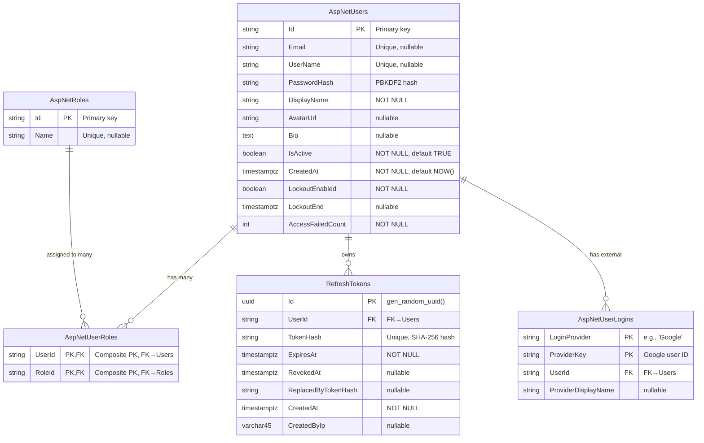

# FR-AUTH Database Design

**Version:** 1.0.0
**Date:** 2026-09-11
**Scope:** FR-AUTH Module Only
**Target:** PostgreSQL 16 + ASP.NET Core Identity + EF Core

---

## 1. FR-AUTH Data Requirement Matrix


| FR          | Data cần đọc                                                         | Data cần ghi                                                                          | Entity/Table liên quan                                        |
| ----------- | -------------------------------------------------------------------- | ------------------------------------------------------------------------------------- | ------------------------------------------------------------- |
| FR-AUTH-001 | -                                                                    | displayName, email, userName, password (hash), role=Author, refreshToken, accessToken | AspNetUsers, AspNetUserRoles, RefreshTokens                   |
| FR-AUTH-002 | email, passwordHash, lockoutEnd, accessFailedCount                   | accessFailedCount (update), refreshToken, accessToken                                 | AspNetUsers, RefreshTokens                                    |
| FR-AUTH-003 | AspNetUserLogins (by providerKey), email (check existing)            | AspNetUsers, AspNetUserLogins, AspNetUserRoles, refreshToken, accessToken             | AspNetUsers, AspNetUserLogins, AspNetUserRoles, RefreshTokens |
| FR-AUTH-004 | refreshToken (by hash), userId, expiresAt, IsRevoked, ReplacedByHash | IsRevoked, ReplacedByHash, RevokedAt, newRefreshToken, accessToken                    | RefreshTokens                                                 |
| FR-AUTH-005 | refreshToken (find by hash)                                          | IsRevoked, RevokedAt                                                                  | RefreshTokens                                                 |
| FR-AUTH-006 | AspNetUsers, AspNetUserRoles, roleName                               | -                                                                                     | AspNetUsers, AspNetUserRoles, AspNetRoles                     |
| FR-AUTH-007 | AspNetUsers (by UserId from JWT)                                     | displayName, avatarUrl                                                                | AspNetUsers                                                   |


---

## 2. Entity/Table Inventory


| Table            | Purpose                                        | Source FR                                                       | Ownership             | Type              |
| ---------------- | ---------------------------------------------- | --------------------------------------------------------------- | --------------------- | ----------------- |
| AspNetUsers      | Lưu thông tin người dùng (extended Identity)   | ALL                                                             | ASP.NET Core Identity | Identity Standard |
| AspNetRoles      | Danh sách roles (Author, Admin)                | FR-AUTH-006                                                     | ASP.NET Core Identity | Identity Standard |
| AspNetUserRoles  | Liên kết User-Role (many-to-many)              | FR-AUTH-001, FR-AUTH-003, FR-AUTH-006                           | ASP.NET Core Identity | Identity Standard |
| AspNetUserLogins | External login providers (Google OAuth)        | FR-AUTH-003                                                     | ASP.NET Core Identity | Identity Standard |
| AspNetUserTokens | OAuth tokens (nếu cần)                         | -                                                               | ASP.NET Core Identity | Identity Standard |
| RefreshTokens    | Refresh tokens với rotation/revocation support | FR-AUTH-001, FR-AUTH-002, FR-AUTH-003, FR-AUTH-004, FR-AUTH-005 | FR-AUTH Module        | Custom            |


**Decision:** [DERIVED] Sử dụng đầy đủ ASP.NET Core Identity tables vì:

1. ASP.NET Core Identity đã cung cấp đầy đủ infrastructure cho authentication
2. Custom ApplicationUser cần extends IdentityUser
3. Google OAuth cần AspNetUserLogins
4. RefreshToken cần custom vì Identity không hỗ trợ token rotation mặc định

---

## 3. Detailed Schema

### 3.1 AspNetUsers (Extended Identity)


| Column               | Type         | Nullable | PK  | FK  | Unique | Default | Description                                         | FR                                    |
| -------------------- | ------------ | -------- | --- | --- | ------ | ------- | --------------------------------------------------- | ------------------------------------- |
| Id                   | varchar(450) | NO       | YES | -   | -      | -       | Primary key (string for Identity compatibility)     | ALL                                   |
| DisplayName          | varchar(100) | NO       | -   | -   | -      | -       | Tên hiển thị công khai                              | FR-AUTH-001, FR-AUTH-006, FR-AUTH-007 |
| AvatarUrl            | varchar(500) | YES      | -   | -   | -      | NULL    | URL ảnh đại diện                                    | FR-AUTH-001, FR-AUTH-006, FR-AUTH-007 |
| Bio                  | text         | YES      | -   | -   | -      | NULL    | Tiểu sử ngắn                                        | FR-AUTH-006                           |
| IsActive             | boolean      | NO       | -   | -   | -      | TRUE    | Trạng thái tài khoản (Admin có thể deactivate)      | FR-AUTH-002                           |
| CreatedAt            | timestamptz  | NO       | -   | -   | -      | NOW()   | Ngày tạo tài khoản                                  | FR-AUTH-006                           |
| UserName             | varchar(256) | YES      | -   | -   | YES    | -       | Identity: Tên đăng nhập                             | FR-AUTH-001                           |
| NormalizedUserName   | varchar(256) | YES      | -   | -   | YES    | -       | Identity: normalized username                       | Identity                              |
| Email                | varchar(256) | YES      | -   | -   | YES    | -       | Identity: Email                                     | FR-AUTH-001, FR-AUTH-002, FR-AUTH-003 |
| NormalizedEmail      | varchar(256) | YES      | -   | -   | YES    | -       | Identity: normalized email                          | Identity                              |
| PasswordHash         | varchar(500) | YES      | -   | -   | -      | -       | Identity: PBKDF2 hash                               | FR-AUTH-002                           |
| SecurityStamp        | varchar(500) | YES      | -   | -   | -      | -       | Identity: security stamp (change on password reset) | Identity                              |
| ConcurrencyStamp     | varchar(500) | YES      | -   | -   | -      | -       | Identity: concurrency token                         | Identity                              |
| PhoneNumber          | varchar(500) | YES      | -   | -   | -      | NULL    | Identity: SĐT                                       | - (not in FR-AUTH scope)              |
| PhoneNumberConfirmed | boolean      | NO       | -   | -   | -      | FALSE   | Identity: SĐT đã xác nhận                           | -                                     |
| TwoFactorEnabled     | boolean      | NO       | -   | -   | -      | FALSE   | Identity: 2FA enabled                               | -                                     |
| TwoFactorEnd         | timestamptz  | YES      | -   | -   | -      | NULL    | Identity: 2FA lockout end                           | FR-AUTH-002                           |
| LockoutEnd           | timestamptz  | YES      | -   | -   | -      | NULL    | Identity: Lockout end time                          | FR-AUTH-002                           |
| LockoutEnabled       | boolean      | NO       | -   | -   | -      | TRUE    | Identity: Lockout enabled                           | FR-AUTH-002                           |
| AccessFailedCount    | integer      | NO       | -   | -   | -      | 0       | Identity: Số lần đăng nhập thất bại                 | FR-AUTH-002                           |


**Notes:**

- [REQUIREMENT] DisplayName, AvatarUrl, Bio, IsActive, CreatedAt là custom columns thêm vào AspNetUsers
- [REQUIREMENT] Các Identity columns được ASP.NET Core Identity quản lý
- [DERIVED] UserName và Email phải unique (Identity requirement)
- [DERIVED] LockoutEnabled=true + LockoutEnd &gt; NOW() = tài khoản bị khóa

---

### 3.2 AspNetRoles


| Column           | Type         | Nullable | PK  | FK  | Unique | Default | Description       | FR                                    |
| ---------------- | ------------ | -------- | --- | --- | ------ | ------- | ----------------- | ------------------------------------- |
| Id               | varchar(450) | NO       | YES | -   | -      | -       | Primary key       | FR-AUTH-006                           |
| Name             | varchar(256) | YES      | -   | -   | YES    | -       | Tên role          | FR-AUTH-001, FR-AUTH-003, FR-AUTH-006 |
| NormalizedName   | varchar(256) | YES      | -   | -   | YES    | -       | Normalized name   | Identity                              |
| ConcurrencyStamp | varchar(500) | YES      | -   | -   | -      | -       | Concurrency token | Identity                              |


**Notes:**

- [REQUIREMENT] FR-AUTH chỉ cần Author và Admin roles
- [DERIVED] Roles được seed: "Author" và "Admin"

---

### 3.3 AspNetUserRoles (Join Table)


| Column | Type         | Nullable | PK              | FK                   | Unique | Default | Description | FR                                    |
| ------ | ------------ | -------- | --------------- | -------------------- | ------ | ------- | ----------- | ------------------------------------- |
| UserId | varchar(450) | NO       | YES (composite) | YES → AspNetUsers.Id | -      | -       | FK to User  | FR-AUTH-001, FR-AUTH-003, FR-AUTH-006 |
| RoleId | varchar(450) | NO       | YES (composite) | YES → AspNetRoles.Id | -      | -       | FK to Role  | FR-AUTH-001, FR-AUTH-003, FR-AUTH-006 |


**Notes:**

- [REQUIREMENT] Composite PK (UserId, RoleId)
- [DERIVED] Cascade delete: khi xóa User, xóa các UserRole entries

---

### 3.4 AspNetUserLogins


| Column              | Type         | Nullable | PK              | FK                   | Unique | Default | Description                            | FR          |
| ------------------- | ------------ | -------- | --------------- | -------------------- | ------ | ------- | -------------------------------------- | ----------- |
| LoginProvider       | varchar(450) | NO       | YES (composite) | -                    | -      | -       | Provider name (e.g., "Google")         | FR-AUTH-003 |
| ProviderKey         | varchar(450) | NO       | YES (composite) | -                    | -      | -       | Provider-specific key (Google user ID) | FR-AUTH-003 |
| ProviderDisplayName | varchar(450) | YES      | -               | -                    | -      | NULL    | Display name của provider              | FR-AUTH-003 |
| UserId              | varchar(450) | NO       | -               | YES → AspNetUsers.Id | -      | -       | FK to User                             | FR-AUTH-003 |


**Notes:**

- [REQUIREMENT] FR-AUTH-003 cần lưu Google OAuth login info
- [REQUIREMENT] LoginProvider = "Google" cho Google OAuth
- [REQUIREMENT] ProviderKey = Google's user ID (sub claim)
- [DERIVED] Composite PK (LoginProvider, ProviderKey)
- [DERIVED] Cascade delete: khi xóa User, xóa các UserLogins entries

---

### 3.5 RefreshTokens


| Column              | Type         | Nullable | PK  | FK                   | Unique | Default           | Description                               | FR                                                              |
| ------------------- | ------------ | -------- | --- | -------------------- | ------ | ----------------- | ----------------------------------------- | --------------------------------------------------------------- |
| Id                  | uuid         | NO       | YES | -                    | -      | gen_random_uuid() | Primary key                               | FR-AUTH-001, FR-AUTH-002, FR-AUTH-003, FR-AUTH-004              |
| UserId              | varchar(450) | NO       | -   | YES → AspNetUsers.Id | -      | -                 | Chủ sở hữu token                          | FR-AUTH-001, FR-AUTH-002, FR-AUTH-003, FR-AUTH-004, FR-AUTH-005 |
| TokenHash           | varchar(64)  | NO       | -   | -                    | YES    | -                 | SHA-256 hash của refresh token            | FR-AUTH-004, FR-AUTH-005                                        |
| ExpiresAt           | timestamptz  | NO       | -   | -                    | -      | -                 | Thời điểm hết hạn (7 ngày)                | FR-AUTH-004                                                     |
| RevokedAt           | timestamptz  | YES      | -   | -                    | -      | NULL              | Thời điểm bị revoke (NULL = còn hiệu lực) | FR-AUTH-004, FR-AUTH-005                                        |
| ReplacedByTokenHash | varchar(64)  | YES      | -   | -                    | -      | NULL              | Hash của token thay thế (token rotation)  | FR-AUTH-004                                                     |
| CreatedAt           | timestamptz  | NO       | -   | -                    | -      | NOW()             | Thời điểm tạo token                       | FR-AUTH-001, FR-AUTH-002, FR-AUTH-003                           |
| CreatedByIp         | varchar(45)  | YES      | -   | -                    | -      | NULL              | IP address tạo token (audit)              | FR-AUTH-001, FR-AUTH-002, FR-AUTH-003                           |


**Notes:**

- [REQUIREMENT] FR-AUTH-004 yêu cầu token rotation với reuse detection
- [REQUIREMENT] FR-AUTH-005 yêu cầu token revocation
- [PROPOSAL] Sử dụng TokenHash thay vì lưu plaintext token vì:
  1. Nếu database bị leak, attacker không thể dùng refresh tokens
  2. Token rotation vẫn hoạt động (chỉ cần hash new token và lưu)
  3. Verification: hash incoming token và so sánh với TokenHash
- [DERIVED] TokenHash UNIQUE vì mỗi hash chỉ đại diện cho 1 token
- [DERIVED] Index trên UserId để query tokens của user nhanh
- [DERIVED] Index trên (ExpiresAt, RevokedAt) để query active tokens

---

## 4. Relationship Model

```
┌─────────────────────────────────────────────────────────────────────────┐
│                     FR-AUTH ENTITY RELATIONSHIPS                        │
├─────────────────────────────────────────────────────────────────────────┤
│                                                                          │
│   ┌─────────────────┐                                                   │
│   │  AspNetRoles    │                                                   │
│   ├─────────────────┤                                                   │
│   │ PK Id (string)  │◄────────────┐                                   │
│   │ Name            │              │ 1:N                                │
│   └─────────────────┘              │                                    │
│                                     │                                    │
│   ┌─────────────────────────────────┴─────────────────────────────────┐   │
│   │                     AspNetUserRoles                              │   │
│   ├─────────────────────────────────────────────────────────────────┤   │
│   │ PK+FK UserId (string) ──────────────────────────────────────────┼───┤
│   │ PK+FK RoleId (string) ──────────────────────────────────────────┼───┤
│   └─────────────────────────────────────────────────────────────────┘   │
│                                     ▲                                    │
│                                     │ 1:N                                │
│   ┌─────────────────────────────────┴─────────────────────────────────┐   │
│   │                        AspNetUsers                               │   │
│   ├─────────────────────────────────────────────────────────────────┤   │
│   │ PK Id (string)                                                  │   │
│   │ Email (unique)                                                  │   │
│   │ UserName (unique)                                               │   │
│   │ PasswordHash                                                    │   │
│   │ DisplayName ★ NEW                                               │   │
│   │ AvatarUrl ★ NEW                                                │   │
│   │ Bio ★ NEW                                                      │   │
│   │ IsActive ★ NEW                                                 │   │
│   │ CreatedAt ★ NEW                                                 │   │
│   │ + Standard Identity columns                                      │   │
│   └─────────────────────────────────────────────────────────────────┘   │
│                                     │                                    │
│                    ┌────────────────┼────────────────┐                  │
│                    │ 1:N            │                │ 1:N               │
│                    ▼                │                ▼                   │
│   ┌───────────────────┐    ┌────────┴────────┐    ┌───────────────────┐│
│   │ AspNetUserLogins  │    │ RefreshTokens   │    │ AspNetUserClaims ││
│   ├───────────────────┤    ├─────────────────┤    ├───────────────────┤│
│   │ PK LoginProvider  │    │ PK Id (uuid)    │    │ Standard Identity ││
│   │ PK ProviderKey    │    │ FK UserId       │    │ (not needed for   ││
│   │ FK UserId         │    │ TokenHash (idx) │    │  FR-AUTH scope)   ││
│   │ ProviderDisplayName│   │ ExpiresAt       │    └───────────────────┘│
│   └───────────────────┘    │ RevokedAt       │                         │
│                            │ ReplacedByHash  │                         │
│                            │ CreatedAt       │                         │
│                            │ CreatedByIp     │                         │
│                            └─────────────────┘                         │
│                                                                          │
│   LEGEND:                                                                │
│   ★ = Custom column (not in standard Identity)                          │
│   PK = Primary Key                                                       │
│   FK = Foreign Key (implied by relationship)                             │
│   idx = Indexed column                                                   │
│                                                                          │
└─────────────────────────────────────────────────────────────────────────┘
```

### 4.1 Relationship Details


| Relationship         | Type | From           | To                      | Cascade        | Notes                         |
| -------------------- | ---- | -------------- | ----------------------- | -------------- | ----------------------------- |
| User → UserRoles     | 1:N  | AspNetUsers.Id | AspNetUserRoles.UserId  | Cascade Delete | User có nhiều roles           |
| Role → UserRoles     | 1:N  | AspNetRoles.Id | AspNetUserRoles.RoleId  | Cascade Delete | Role được gán cho nhiều users |
| User → RefreshTokens | 1:N  | AspNetUsers.Id | RefreshTokens.UserId    | Cascade Delete | User có nhiều refresh tokens  |
| User → UserLogins    | 1:N  | AspNetUsers.Id | AspNetUserLogins.UserId | Cascade Delete | User có nhiều external logins |
| User → UserClaims    | 1:N  | AspNetUsers.Id | AspNetUserClaims.UserId | Cascade Delete | Không cần cho FR-AUTH         |


---

## 5. ERD (Mermaid)



---

## 6. PostgreSQL DDL

```sql
-- ============================================================================
-- FR-AUTH Database Schema for Culinary Blog
-- PostgreSQL 16
-- ============================================================================

-- Enable required extensions
CREATE EXTENSION IF NOT EXISTS "pgcrypto";

-- ============================================================================
-- TABLE: AspNetRoles
-- Purpose: Store user roles (Author, Admin)
-- Source: ASP.NET Core Identity
-- ============================================================================

CREATE TABLE "AspNetRoles" (
    "Id" varchar(450) NOT NULL,
    "Name" varchar(256) NULL,
    "NormalizedName" varchar(256) NULL,
    "ConcurrencyStamp" varchar(500) NULL,
    CONSTRAINT "PK_AspNetRoles" PRIMARY KEY ("Id")
);

-- Unique constraint on Role Name
CREATE UNIQUE INDEX "RoleNameIndex"
    ON "AspNetRoles" ("NormalizedName");


-- ============================================================================
-- TABLE: AspNetUsers
-- Purpose: Store user accounts (extended from Identity)
-- Source: ASP.NET Core Identity + FR-AUTH custom columns
-- ============================================================================

CREATE TABLE "AspNetUsers" (
    -- Primary Key
    "Id" varchar(450) NOT NULL,
    
    -- Standard Identity Columns
    "UserName" varchar(256) NULL,
    "NormalizedUserName" varchar(256) NULL,
    "Email" varchar(256) NULL,
    "NormalizedEmail" varchar(256) NULL,
    "PasswordHash" varchar(500) NULL,
    "SecurityStamp" varchar(500) NULL,
    "ConcurrencyStamp" varchar(500) NULL,
    "PhoneNumber" varchar(500) NULL,
    "PhoneNumberConfirmed" boolean NOT NULL DEFAULT FALSE,
    "TwoFactorEnabled" boolean NOT NULL DEFAULT FALSE,
    "TwoFactorEnd" timestamptz NULL,
    "LockoutEnd" timestamptz NULL,
    "LockoutEnabled" boolean NOT NULL DEFAULT TRUE,
    "AccessFailedCount" integer NOT NULL DEFAULT 0,
    
    -- Custom Columns (FR-AUTH specific)
    "DisplayName" varchar(100) NOT NULL,
    "AvatarUrl" varchar(500) NULL,
    "Bio" text NULL,
    "IsActive" boolean NOT NULL DEFAULT TRUE,
    "CreatedAt" timestamptz NOT NULL DEFAULT NOW(),
    
    CONSTRAINT "PK_AspNetUsers" PRIMARY KEY ("Id")
);

-- Unique constraints
CREATE UNIQUE INDEX "UserNameIndex"
    ON "AspNetUsers" ("NormalizedUserName");

CREATE UNIQUE INDEX "EmailIndex"
    ON "AspNetUsers" ("NormalizedEmail");

-- Index for login queries
CREATE INDEX "IX_AspNetUsers_Email"
    ON "AspNetUsers" ("Email");


-- ============================================================================
-- TABLE: AspNetUserRoles
-- Purpose: Join table for User-Role many-to-many relationship
-- Source: ASP.NET Core Identity
-- ============================================================================

CREATE TABLE "AspNetUserRoles" (
    "UserId" varchar(450) NOT NULL,
    "RoleId" varchar(450) NOT NULL,
    CONSTRAINT "PK_AspNetUserRoles" PRIMARY KEY ("UserId", "RoleId"),
    CONSTRAINT "FK_AspNetUserRoles_AspNetRoles_RoleId"
        FOREIGN KEY ("RoleId") REFERENCES "AspNetRoles" ("Id")
        ON DELETE CASCADE,
    CONSTRAINT "FK_AspNetUserRoles_AspNetUsers_UserId"
        FOREIGN KEY ("UserId") REFERENCES "AspNetUsers" ("Id")
        ON DELETE CASCADE
);

CREATE INDEX "IX_AspNetUserRoles_RoleId"
    ON "AspNetUserRoles" ("RoleId");


-- ============================================================================
-- TABLE: AspNetUserLogins
-- Purpose: Store external login providers (Google OAuth)
-- Source: ASP.NET Core Identity
-- ============================================================================

CREATE TABLE "AspNetUserLogins" (
    "LoginProvider" varchar(450) NOT NULL,
    "ProviderKey" varchar(450) NOT NULL,
    "ProviderDisplayName" varchar(450) NULL,
    "UserId" varchar(450) NOT NULL,
    CONSTRAINT "PK_AspNetUserLogins" PRIMARY KEY ("LoginProvider", "ProviderKey"),
    CONSTRAINT "FK_AspNetUserLogins_AspNetUsers_UserId"
        FOREIGN KEY ("UserId") REFERENCES "AspNetUsers" ("Id")
        ON DELETE CASCADE
);

CREATE INDEX "IX_AspNetUserLogins_UserId"
    ON "AspNetUserLogins" ("UserId");


-- ============================================================================
-- TABLE: RefreshTokens
-- Purpose: Store JWT refresh tokens with rotation/revocation support
-- Source: FR-AUTH Custom (not provided by Identity)
-- ============================================================================

CREATE TABLE "RefreshTokens" (
    -- Primary Key
    "Id" uuid NOT NULL DEFAULT gen_random_uuid(),
    
    -- User Association
    "UserId" varchar(450) NOT NULL,
    
    -- Token Data (stored as hash for security)
    "TokenHash" varchar(64) NOT NULL,
    
    -- Token Lifecycle
    "ExpiresAt" timestamptz NOT NULL,
    "RevokedAt" timestamptz NULL,
    "ReplacedByTokenHash" varchar(64) NULL,
    
    -- Audit
    "CreatedAt" timestamptz NOT NULL DEFAULT NOW(),
    "CreatedByIp" varchar(45) NULL,
    
    CONSTRAINT "PK_RefreshTokens" PRIMARY KEY ("Id"),
    CONSTRAINT "FK_RefreshTokens_AspNetUsers_UserId"
        FOREIGN KEY ("UserId") REFERENCES "AspNetUsers" ("Id")
        ON DELETE CASCADE
);

-- Unique constraint: each token hash is unique
CREATE UNIQUE INDEX "IX_RefreshTokens_TokenHash"
    ON "RefreshTokens" ("TokenHash");

-- Index for user lookup
CREATE INDEX "IX_RefreshTokens_UserId"
    ON "RefreshTokens" ("UserId");

-- Index for finding active tokens (not revoked, not expired)
CREATE INDEX "IX_RefreshTokens_ActiveTokens"
    ON "RefreshTokens" ("UserId", "ExpiresAt", "RevokedAt")
    WHERE "RevokedAt" IS NULL;


-- ============================================================================
-- TABLE: AspNetUserClaims (optional, for future use)
-- Purpose: Store additional user claims
-- Source: ASP.NET Core Identity (not required for FR-AUTH)
-- ============================================================================

-- NOT CREATED: Not needed for FR-AUTH scope
-- CREATE TABLE "AspNetUserClaims" (...)


-- ============================================================================
-- TABLE: AspNetUserTokens (optional)
-- Purpose: Store OAuth tokens from external providers
-- Source: ASP.NET Core Identity (not required for FR-AUTH)
-- ============================================================================

-- NOT CREATED: Not needed for FR-AUTH scope
-- Google OAuth uses Authorization Code flow, not implicit/hybrid
-- Tokens are exchanged on backend, no need to store in DB


-- ============================================================================
-- SEED DATA: Default Roles
-- ============================================================================

INSERT INTO "AspNetRoles" ("Id", "Name", "NormalizedName", "ConcurrencyStamp")
VALUES
    ('role-author', 'Author', 'AUTHOR', gen_random_uuid()),
    ('role-admin', 'Admin', 'ADMIN', gen_random_uuid())
ON CONFLICT DO NOTHING;

-- Mark as successfully created (will be skipped if roles exist)
DO $$
BEGIN
    IF NOT EXISTS (SELECT 1 FROM "AspNetRoles" WHERE "Id" = 'role-author') THEN
        INSERT INTO "AspNetRoles" ("Id", "Name", "NormalizedName", "ConcurrencyStamp")
        VALUES ('role-author', 'Author', 'AUTHOR', gen_random_uuid());
    END IF;
    
    IF NOT EXISTS (SELECT 1 FROM "AspNetRoles" WHERE "Id" = 'role-admin') THEN
        INSERT INTO "AspNetRoles" ("Id", "Name", "NormalizedName", "ConcurrencyStamp")
        VALUES ('role-admin', 'Admin', 'ADMIN', gen_random_uuid());
    END IF;
END $$;
```

---

## 7. EF Core Model

### 7.1 Project Structure

```
CulinaryBlog/
├── src/
│   ├── CulinaryBlog.Domain/
│   │   └── Entities/
│   │       └── BaseEntity.cs          # If using BaseEntity pattern
│   │
│   ├── CulinaryBlog.Infrastructure/
│   │   └── Persistence/
│   │       ├── Configurations/
│   │       │   ├── ApplicationUserConfiguration.cs
│   │       │   ├── RefreshTokenConfiguration.cs
│   │       │   └── IdentityConfigurations.cs
│   │       │
│   │       └── CulinaryBlogDbContext.cs
│   │
│   └── CulinaryBlog.API/
│       └── Program.cs                 # Identity configuration
```

### 7.2 Domain Entities

**ApplicationUser.cs**

```csharp
// CulinaryBlog.Domain/Entities/ApplicationUser.cs

using Microsoft.AspNetCore.Identity;

/// <summary>
/// Extended ApplicationUser for Culinary Blog
/// Extends IdentityUser<string> to leverage ASP.NET Core Identity
/// </summary>
public class ApplicationUser : IdentityUser<string>
{
    // Custom properties for FR-AUTH
    public string DisplayName { get; set; } = string.Empty;
    
    public string? AvatarUrl { get; set; }
    
    public string? Bio { get; set; }
    
    public bool IsActive { get; set; } = true;
    
    public DateTime CreatedAt { get; set; } = DateTime.UtcNow;
    
    // Navigation properties
    public virtual ICollection<RefreshToken> RefreshTokens { get; set; } = new List<RefreshToken>();
    
    public virtual ICollection<IdentityUserRole<string>> UserRoles { get; set; } = new List<IdentityUserRole<string>>();
    
    public virtual ICollection<IdentityUserLogin<string>> Logins { get; set; } = new List<IdentityUserLogin<string>>();
    
    // Factory method for creating new users
    public static ApplicationUser Create(string displayName, string email, string userName)
    {
        return new ApplicationUser
        {
            Id = Guid.NewGuid().ToString(),
            DisplayName = displayName,
            Email = email,
            UserName = userName,
            NormalizedEmail = email.ToUpperInvariant(),
            NormalizedUserName = userName.ToUpperInvariant(),
            CreatedAt = DateTime.UtcNow,
            IsActive = true,
            LockoutEnabled = true, // Enable lockout for brute force protection
            AccessFailedCount = 0
        };
    }
}
```

**RefreshToken.cs**

```csharp
// CulinaryBlog.Domain/Entities/RefreshToken.cs

using System.Security.Cryptography;

public class RefreshToken
{
    public Guid Id { get; set; } = Guid.NewGuid();
    
    public string UserId { get; set; } = string.Empty;
    
    public string TokenHash { get; set; } = string.Empty;
    
    public DateTime ExpiresAt { get; set; }
    
    public DateTime? RevokedAt { get; set; }
    
    public string? ReplacedByTokenHash { get; set; }
    
    public DateTime CreatedAt { get; set; } = DateTime.UtcNow;
    
    public string? CreatedByIp { get; set; }
    
    // Navigation
    public virtual ApplicationUser User { get; set; } = null!;
    
    // Computed properties
    public bool IsExpired => DateTime.UtcNow > ExpiresAt;
    
    public bool IsRevoked => RevokedAt.HasValue;
    
    public bool IsActive => !IsExpired && !IsRevoked;
    
    // Factory method
    public static RefreshToken Create(string userId, string rawToken, string? ipAddress = null)
    {
        return new RefreshToken
        {
            Id = Guid.NewGuid(),
            UserId = userId,
            TokenHash = HashToken(rawToken),
            ExpiresAt = DateTime.UtcNow.AddDays(7), // 7 days TTL
            CreatedAt = DateTime.UtcNow,
            CreatedByIp = ipAddress
        };
    }
    
    // Hash token using SHA-256
    public static string HashToken(string token)
    {
        var bytes = SHA256.HashData(System.Text.Encoding.UTF8.GetBytes(token));
        return Convert.ToHexString(bytes).ToLowerInvariant();
    }
    
    // Revoke this token and specify replacement
    public void Revoke(string replacedByTokenHash)
    {
        RevokedAt = DateTime.UtcNow;
        ReplacedByTokenHash = replacedByTokenHash;
    }
}
```

### 7.3 EF Core Configurations

**ApplicationUserConfiguration.cs**

```csharp
// CulinaryBlog.Infrastructure/Persistence/Configurations/ApplicationUserConfiguration.cs

using Microsoft.EntityFrameworkCore;
using Microsoft.EntityFrameworkCore.Metadata.Builders;

public class ApplicationUserConfiguration : IEntityTypeConfiguration<ApplicationUser>
{
    public void Configure(EntityTypeBuilder<ApplicationUser> builder)
    {
        builder.ToTable("AspNetUsers");
        
        // Primary key
        builder.HasKey(u => u.Id);
        
        // Custom columns
        builder.Property(u => u.DisplayName)
            .IsRequired()
            .HasMaxLength(100);
        
        builder.Property(u => u.AvatarUrl)
            .HasMaxLength(500);
        
        builder.Property(u => u.Bio)
            .HasColumnType("text");
        
        builder.Property(u => u.IsActive)
            .HasDefaultValue(true);
        
        builder.Property(u => u.CreatedAt)
            .HasDefaultValueSql("NOW()");
        
        // Unique constraints
        builder.HasIndex(u => u.NormalizedUserName)
            .IsUnique()
            .HasDatabaseName("UserNameIndex");
        
        builder.HasIndex(u => u.NormalizedEmail)
            .IsUnique()
            .HasDatabaseName("EmailIndex");
        
        // Index for login queries
        builder.HasIndex(u => u.Email)
            .HasDatabaseName("IX_AspNetUsers_Email");
        
        // Navigation properties
        builder.HasMany(u => u.RefreshTokens)
            .WithOne(rt => rt.User)
            .HasForeignKey(rt => rt.UserId)
            .OnDelete(DeleteBehavior.Cascade);
        
        builder.HasMany(u => u.Logins)
            .WithOne(l => l.User)
            .HasForeignKey(l => l.UserId)
            .OnDelete(DeleteBehavior.Cascade);
    }
}
```

**RefreshTokenConfiguration.cs**

```csharp
// CulinaryBlog.Infrastructure/Persistence/Configurations/RefreshTokenConfiguration.cs

using Microsoft.EntityFrameworkCore;
using Microsoft.EntityFrameworkCore.Metadata.Builders;

public class RefreshTokenConfiguration : IEntityTypeConfiguration<RefreshToken>
{
    public void Configure(EntityTypeBuilder<RefreshToken> builder)
    {
        builder.ToTable("RefreshTokens");
        
        // Primary key
        builder.HasKey(rt => rt.Id);
        
        builder.Property(rt => rt.Id)
            .HasDefaultValueSql("gen_random_uuid()");
        
        // Token hash (unique)
        builder.Property(rt => rt.TokenHash)
            .IsRequired()
            .HasMaxLength(64);
        
        builder.HasIndex(rt => rt.TokenHash)
            .IsUnique()
            .HasDatabaseName("IX_RefreshTokens_TokenHash");
        
        // UserId index
        builder.HasIndex(rt => rt.UserId)
            .HasDatabaseName("IX_RefreshTokens_UserId");
        
        // Composite index for finding active tokens
        builder.HasIndex(rt => new { rt.UserId, rt.ExpiresAt, rt.RevokedAt })
            .HasDatabaseName("IX_RefreshTokens_ActiveTokens")
            .HasFilter("\"RevokedAt\" IS NULL");
        
        // ExpiresAt
        builder.Property(rt => rt.ExpiresAt)
            .IsRequired();
        
        // ReplacedByTokenHash
        builder.Property(rt => rt.ReplacedByTokenHash)
            .HasMaxLength(64);
        
        // CreatedAt
        builder.Property(rt => rt.CreatedAt)
            .HasDefaultValueSql("NOW()");
        
        // CreatedByIp
        builder.Property(rt => rt.CreatedByIp)
            .HasMaxLength(45); // IPv6 max length
        
        // Relationships
        builder.HasOne(rt => rt.User)
            .WithMany(u => u.RefreshTokens)
            .HasForeignKey(rt => rt.UserId)
            .OnDelete(DeleteBehavior.Cascade);
    }
}
```

**IdentityRoleConfiguration.cs**

```csharp
// CulinaryBlog.Infrastructure/Persistence/Configurations/IdentityRoleConfiguration.cs

using Microsoft.EntityFrameworkCore;
using Microsoft.EntityFrameworkCore.Metadata.Builders;

public class IdentityRoleConfiguration : IEntityTypeConfiguration[[ORCA_RICH_MD:a8d44379be599638b32c8a762e8db201:inline-html:%3CIdentityRole%3E]]
{
    public void Configure(EntityTypeBuilder[[ORCA_RICH_MD:a8d44379be599638b32c8a762e8db201:inline-html:%3CIdentityRole%3E]] builder)
    {
        builder.ToTable("AspNetRoles");
        
        // Primary key
        builder.HasKey(r => r.Id);
        
        // Role name unique
        builder.HasIndex(r => r.NormalizedName)
            .IsUnique()
            .HasDatabaseName("RoleNameIndex");
    }
}
```

**IdentityUserRoleConfiguration.cs**

```csharp
// CulinaryBlog.Infrastructure/Persistence/Configurations/IdentityUserRoleConfiguration.cs

using Microsoft.EntityFrameworkCore;
using Microsoft.EntityFrameworkCore.Metadata.Builders;

public class IdentityUserRoleConfiguration : IEntityTypeConfiguration<IdentityUserRole<string>>
{
    public void Configure(EntityTypeBuilder<IdentityUserRole<string>> builder)
    {
        builder.ToTable("AspNetUserRoles");
        
        // Composite primary key
        builder.HasKey(ur => new { ur.UserId, ur.RoleId });
        
        // Indexes
        builder.HasIndex(ur => ur.RoleId)
            .HasDatabaseName("IX_AspNetUserRoles_RoleId");
    }
}
```

**IdentityUserLoginConfiguration.cs**

```csharp
// CulinaryBlog.Infrastructure/Persistence/Configurations/IdentityUserLoginConfiguration.cs

using Microsoft.EntityFrameworkCore;
using Microsoft.EntityFrameworkCore.Metadata.Builders;

public class IdentityUserLoginConfiguration : IEntityTypeConfiguration<IdentityUserLogin<string>>
{
    public void Configure(EntityTypeBuilder<IdentityUserLogin<string>> builder)
    {
        builder.ToTable("AspNetUserLogins");
        
        // Composite primary key
        builder.HasKey(l => new { l.LoginProvider, l.ProviderKey });
        
        // Index
        builder.HasIndex(l => l.UserId)
            .HasDatabaseName("IX_AspNetUserLogins_UserId");
    }
}
```

### 7.4 DbContext

**CulinaryBlogDbContext.cs**

```csharp
// CulinaryBlog.Infrastructure/Persistence/CulinaryBlogDbContext.cs

using Microsoft.AspNetCore.Identity.EntityFrameworkCore;
using Microsoft.EntityFrameworkCore;

public class CulinaryBlogDbContext : IdentityDbContext[[ORCA_RICH_MD:a8d44379be599638b32c8a762e8db201:inline-html:%3CApplicationUser%3E]]
{
    // RefreshToken DbSet
    public DbSet[[ORCA_RICH_MD:a8d44379be599638b32c8a762e8db201:inline-html:%3CRefreshToken%3E]] RefreshTokens => Set[[ORCA_RICH_MD:a8d44379be599638b32c8a762e8db201:inline-html:%3CRefreshToken%3E]]();
    
    public CulinaryBlogDbContext(DbContextOptions[[ORCA_RICH_MD:a8d44379be599638b32c8a762e8db201:inline-html:%3CCulinaryBlogDbContext%3E]] options)
        : base(options)
    {
    }
    
    protected override void OnModelCreating(ModelBuilder builder)
    {
        base.OnModelCreating(builder);
        
        // Apply configurations
        builder.ApplyConfiguration(new ApplicationUserConfiguration());
        builder.ApplyConfiguration(new RefreshTokenConfiguration());
        builder.ApplyConfiguration(new IdentityRoleConfiguration());
        builder.ApplyConfiguration(new IdentityUserRoleConfiguration());
        builder.ApplyConfiguration(new IdentityUserLoginConfiguration());
        
        // Seed default roles
        builder.Entity[[ORCA_RICH_MD:a8d44379be599638b32c8a762e8db201:inline-html:%3CIdentityRole%3E]]().HasData(
            new IdentityRole
            {
                Id = "role-author",
                Name = "Author",
                NormalizedName = "AUTHOR"
            },
            new IdentityRole
            {
                Id = "role-admin",
                Name = "Admin",
                NormalizedName = "ADMIN"
            }
        );
    }
}
```

### 7.5 Program.cs Configuration

**Identity Configuration**

```csharp
// In Program.cs

builder.Services.AddDbContext<CulinaryBlogDbContext>(options =>
    options.UseNpgsql(connectionString));

builder.Services.AddIdentity<ApplicationUser, IdentityRole>(options =>
{
    // Password requirements (NFR-SEC-001)
    options.Password.RequiredLength = 8;
    options.Password.RequireDigit = true;
    options.Password.RequireLowercase = true;
    options.Password.RequireUppercase = true;
    options.Password.RequireNonAlphanumeric = true;
    options.Password.RequiredUniqueChars = 1;
    
    // Lockout settings (FR-AUTH-002)
    options.Lockout.DefaultLockoutTimeSpan = TimeSpan.FromMinutes(15);
    options.Lockout.MaxFailedAccessAttempts = 5;
    options.Lockout.AllowedForNewUsers = true;
    
    // User settings
    options.User.RequireUniqueEmail = true;
    
    // SignIn settings
    options.SignIn.RequireConfirmedAccount = false; // TODO: implement email confirmation
    options.SignIn.RequireConfirmedEmail = false;
})
.AddEntityFrameworkStores<CulinaryBlogDbContext>()
.AddDefaultTokenProviders();

// Configure JWT
builder.Services.Configure<JwtSettings>(builder.Configuration.GetSection("Jwt"));
builder.Services.Configure<IdentityOptions>(options =>
{
    // Additional Identity configuration if needed
});
```

---

## 8. Security Analysis

### 8.1 Password Security


| Aspect            | Implementation                            | Standard                  |
| ----------------- | ----------------------------------------- | ------------------------- |
| Hashing Algorithm | PBKDF2-HMACSHA512                         | [REQUIREMENT] NFR-SEC-001 |
| Iterations        | ≥ 100,000                                 | [REQUIREMENT] NFR-SEC-001 |
| Storage           | PasswordHash column (managed by Identity) | ASP.NET Core Identity     |
| Plaintext         | NEVER stored                              | [REQUIREMENT]             |
| Verification      | UserManager.CheckPasswordAsync()          | ASP.NET Core Identity     |


**Notes:**

- ASP.NET Core Identity mặc định sử dụng PBKDF2 với HMACSHA256 và 100,000 iterations
- PasswordHash được Identity tự động quản lý
- Không cần custom implementation

### 8.2 Refresh Token Security


| Aspect          | Implementation                      | Standard                  |
| --------------- | ----------------------------------- | ------------------------- |
| Storage         | SHA-256 Hash                        | [PROPOSAL]                |
| Plaintext       | NEVER stored                        | [REQUIREMENT] FR-AUTH-004 |
| Rotation        | Old token revoked, new token issued | [REQUIREMENT] FR-AUTH-004 |
| Reuse Detection | Check if revoked token is used      | [REQUIREMENT] FR-AUTH-004 |
| Expiration      | 7 days                              | [REQUIREMENT] FR-AUTH-004 |
| Revocation      | IsRevoked + RevokedAt               | [REQUIREMENT] FR-AUTH-005 |


**Token Hashing Process:**

```csharp
// When creating token
var rawToken = GenerateSecureToken(512 bits); // 64 bytes hex
var hash = SHA256.HashData(rawToken);           // 32 bytes hex = 64 chars
SaveToDb(hash);
Return rawToken to client;

// When validating token
var hash = SHA256.HashData(incomingToken);
var stored = await _context.RefreshTokens
    .FirstOrDefaultAsync(t => t.TokenHash == hash);
// Compare hashes, not tokens
```

### 8.3 Account Security


| Feature             | Implementation        | FR                        |
| ------------------- | --------------------- | ------------------------- |
| Lockout             | LockoutEnd &gt; NOW() | FR-AUTH-002               |
| Max Failed Attempts | 5 attempts            | [REQUIREMENT] FR-AUTH-002 |
| Lockout Duration    | 15 minutes            | [REQUIREMENT] FR-AUTH-002 |
| Account Active      | IsActive = true       | FR-AUTH-002               |


### 8.4 OAuth Security (Google)


| Aspect       | Implementation             | Standard                  |
| ------------ | -------------------------- | ------------------------- |
| Provider     | Google OAuth 2.0           | [REQUIREMENT] FR-AUTH-003 |
| Flow         | Authorization Code + PKCE  | [REQUIREMENT] FR-AUTH-003 |
| Storage      | AspNetUserLogins           | ASP.NET Core Identity     |
| Provider Key | Google User ID (sub claim) | [REQUIREMENT] FR-AUTH-003 |


### 8.5 Sensitive Data Exposure


| Data              | Exposed via API?    | Protected How                  |
| ----------------- | ------------------- | ------------------------------ |
| PasswordHash      | NO                  | Never returned by API          |
| SecurityStamp     | NO                  | Never returned by API          |
| TokenHash         | NO                  | Only stored as hash            |
| Raw Refresh Token | NO                  | Only returned once on creation |
| ConcurrencyStamp  | NO                  | Used for EF Core concurrency   |
| AccessFailedCount | NO                  | Used internally only           |
| LockoutEnd        | YES (kèm thông báo) | Public endpoint response       |


---

## 9. FR Traceability


| Table/Column         | FR-AUTH                                            | Requirement              |
| -------------------- | -------------------------------------------------- | ------------------------ |
| **AspNetUsers**      |                                                    |                          |
| Id                   | ALL                                                | User identifier          |
| Email                | FR-AUTH-001, FR-AUTH-002, FR-AUTH-003, FR-AUTH-006 | Login, unique identifier |
| UserName             | FR-AUTH-001, FR-AUTH-006                           | Display identifier       |
| PasswordHash         | FR-AUTH-002                                        | Password verification    |
| DisplayName          | FR-AUTH-001, FR-AUTH-006, FR-AUTH-007              | Public display name      |
| AvatarUrl            | FR-AUTH-001, FR-AUTH-006, FR-AUTH-007              | Profile image            |
| Bio                  | FR-AUTH-006                                        | Author bio               |
| IsActive             | FR-AUTH-002                                        | Account status check     |
| CreatedAt            | FR-AUTH-006                                        | Profile display          |
| LockoutEnd           | FR-AUTH-002                                        | Lockout status           |
| LockoutEnabled       | FR-AUTH-002                                        | Lockout feature          |
| AccessFailedCount    | FR-AUTH-002                                        | Failed attempt tracking  |
| **AspNetRoles**      |                                                    |                          |
| Id                   | FR-AUTH-006                                        | Role identifier          |
| Name                 | FR-AUTH-001, FR-AUTH-003, FR-AUTH-006              | Role name (Author/Admin) |
| **AspNetUserRoles**  |                                                    |                          |
| UserId, RoleId       | FR-AUTH-001, FR-AUTH-003, FR-AUTH-006              | Role assignment          |
| **AspNetUserLogins** |                                                    |                          |
| LoginProvider        | FR-AUTH-003                                        | "Google"                 |
| ProviderKey          | FR-AUTH-003                                        | Google User ID           |
| UserId               | FR-AUTH-003                                        | User association         |
| **RefreshTokens**    |                                                    |                          |
| Id                   | ALL                                                | Token identifier         |
| UserId               | ALL                                                | Token owner              |
| TokenHash            | FR-AUTH-004, FR-AUTH-005                           | Token verification       |
| ExpiresAt            | FR-AUTH-004                                        | Expiration check         |
| RevokedAt            | FR-AUTH-004, FR-AUTH-005                           | Revocation status        |
| ReplacedByTokenHash  | FR-AUTH-004                                        | Rotation tracking        |
| CreatedAt            | FR-AUTH-001, FR-AUTH-002, FR-AUTH-003              | Audit                    |
| CreatedByIp          | FR-AUTH-001, FR-AUTH-002, FR-AUTH-003              | IP audit                 |


---

## 10. Scope Validation

### 10.1 Tables Included (FR-AUTH only)


| Table            | Justification                                                             |
| ---------------- | ------------------------------------------------------------------------- |
| AspNetUsers      | [REQUIREMENT] User entity for all FR-AUTH                                 |
| AspNetRoles      | [REQUIREMENT] Role entity for FR-AUTH-006                                 |
| AspNetUserRoles  | [REQUIREMENT] User-Role mapping for FR-AUTH-001, FR-AUTH-003, FR-AUTH-006 |
| AspNetUserLogins | [REQUIREMENT] Google OAuth for FR-AUTH-003                                |
| RefreshTokens    | [REQUIREMENT] Token rotation for FR-AUTH-004, FR-AUTH-005                 |


### 10.2 Tables NOT Included


| Table             | Reason                                       |
| ----------------- | -------------------------------------------- |
| AspNetUserClaims  | Not required for FR-AUTH scope               |
| AspNetRoleClaims  | Not required for FR-AUTH scope               |
| AspNetUserTokens  | Not needed; Google OAuth uses auth code flow |
| AspNetUserTokens  | Not needed for JWT-based auth                |
| Categories        | Belongs to FR-CAT module                     |
| Recipes           | Belongs to FR-RCP module                     |
| RecipeSteps       | Belongs to FR-RCP module                     |
| RecipeIngredients | Belongs to FR-RCP module                     |
| RecipeImages      | Belongs to FR-RCP module                     |
| Any other tables  | Outside FR-AUTH scope                        |


### 10.3 FR Coverage Check


| FR          | Supported? | Implementation                                                |
| ----------- | ---------- | ------------------------------------------------------------- |
| FR-AUTH-001 | ✅          | AspNetUsers, AspNetUserRoles, RefreshTokens                   |
| FR-AUTH-002 | ✅          | AspNetUsers (lockout), RefreshTokens                          |
| FR-AUTH-003 | ✅          | AspNetUsers, AspNetUserLogins, AspNetUserRoles, RefreshTokens |
| FR-AUTH-004 | ✅          | RefreshTokens (rotation, revocation)                          |
| FR-AUTH-005 | ✅          | RefreshTokens (revocation)                                    |
| FR-AUTH-006 | ✅          | AspNetUsers, AspNetUserRoles, AspNetRoles                     |
| FR-AUTH-007 | ✅          | AspNetUsers (DisplayName, AvatarUrl)                          |


### 10.4 Coupling Analysis


| Dependency                        | Type | Justification         |
| --------------------------------- | ---- | --------------------- |
| AspNetUsers.Id → RefreshTokens    | 1:N  | FR-AUTH internal only |
| AspNetUsers.Id → AspNetUserLogins | 1:N  | FR-AUTH internal only |
| AspNetUsers.Id → AspNetUserRoles  | 1:N  | FR-AUTH internal only |
| AspNetRoles.Id → AspNetUserRoles  | 1:N  | FR-AUTH internal only |


**Conclusion:** No coupling with other modules. All relationships are within FR-AUTH scope.

---

## 11. Open Questions &amp; Assumptions

### Assumptions [ASSUMPTION]


| ID  | Assumption                              | Rationale                                                   |
| --- | --------------------------------------- | ----------------------------------------------------------- |
| A1  | UserName và Email luôn unique           | ASP.NET Core Identity yêu cầu                               |
| A2  | Refresh token TTL = 7 ngày              | [REQUIREMENT] FR-AUTH-004                                   |
| A3  | Access token TTL = 15 phút              | [REQUIREMENT] FR-AUTH-004 (nhưng access token không lưu DB) |
| A4  | Lockout duration = 15 phút              | [REQUIREMENT] FR-AUTH-002                                   |
| A5  | Max failed attempts = 5                 | [REQUIREMENT] FR-AUTH-002                                   |
| A6  | Google ProviderKey = Google "sub" claim | Standard OAuth 2.0                                          |
| A7  | RefreshToken.Id = UUID                  | Đủ unique, không cần sequential                             |


### Unknowns [UNKNOWN]


| ID  | Unknown                                          | Impact                      |
| --- | ------------------------------------------------ | --------------------------- |
| U1  | Có cần AspNetUserClaims cho FR khác không?       | Nếu có, cần bổ sung table   |
| U2  | Có cần device tracking cho refresh tokens không? | Chỉ có CreatedByIp hiện tại |


### Conflicts [CONFLICT]


| ID  | Conflict                                                                                 | Resolution                                                                          |
| --- | ---------------------------------------------------------------------------------------- | ----------------------------------------------------------------------------------- |
| C1  | SRS Section 7.7 nói ApplicationUser extends IdentityUser nhưng không nói cụ thể key type | [DERIVED] Sử dụng string key vì đây là standard ASP.NET Core Identity configuration |


---

## 12. Summary

### Database Design for FR-AUTH Complete


| Aspect             | Result                                  |
| ------------------ | --------------------------------------- |
| Tables             | 5 (4 Identity + 1 custom RefreshTokens) |
| Custom Tables      | 1 (RefreshTokens)                       |
| Total Columns      | ~40                                     |
| Indexes            | 8                                       |
| Unique Constraints | 4                                       |
| Foreign Keys       | 5                                       |
| FR Coverage        | 100% (7/7 FRs)                          |


### Key Design Decisions

1. **ASP.NET Core Identity Integration**
  - Sử dụng đầy đủ Identity infrastructure
  - Chỉ thêm custom columns cần thiết cho FR-AUTH
2. **RefreshToken Hashing**
  - Lưu SHA-256 hash thay vì plaintext
  - Hỗ trợ token rotation và reuse detection
3. **No Unnecessary Entities**
  - Không tạo UserRole riêng (dùng Identity)
  - Không tạo GoogleLogin riêng (dùng Identity)
  - Không tạo RefreshToken riêng nếu không cần rotation
4. **Scope Isolation**
  - Không có foreign key đến modules khác
  - FR-AUTH hoàn toàn độc lập về database

